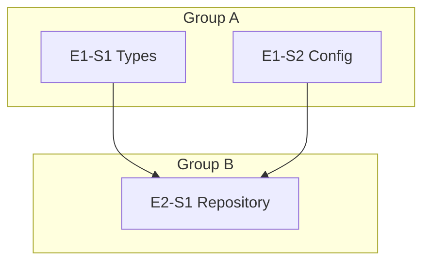

# Spec Skill — Story Decomposition & Feature Generation

> **Ultracode tip:** Decomposition benefits from broad parallel exploration of stories and dependency edges, so `/effort ultracode` is a good fit here. Drop back to `/effort high` before the execution phases (`/auto`, `/implement`).

## Usage

```
/spec specs/brd/brd.md
```

Pass the path to the approved BRD as the argument. Produces epics, stories, a dependency graph, and a `features.json` for session chaining.

---

## Overview

This is the second gate in the SDLC pipeline. The planner agent reads an approved BRD, or an existing set of user stories, and normalizes them into structured, independently executable units of work. Every implementation-ready story gets testable acceptance criteria, a layer assignment, a dependency group, a readiness marker, and deterministic story-point metadata. A machine-readable root `features.json` is generated from those criteria so the evaluator can track pass/fail state across sessions.

---

## Steps

### Step 1 — Read the BRD

Read the file at the path provided as the argument. Confirm the document exists and is an approved BRD. If the file is missing, halt and ask the human to run `/brd` first.

If `specs/brd/brd-analysis.json` exists, read it before decomposing stories. It is the BRD analysis pack produced by `/brd`, and it carries the ambiguity, edge-case, acceptance-coverage, and risk signals that should shape story boundaries.

Use the analysis pack this way:
- Use `ambiguity_table` to avoid converting unresolved ambiguity into implementation scope. A high-risk deferred ambiguity should become `needs_breakdown` or an explicit Open Question, not a guessed story.
- Use `edge_case_table` to create acceptance criteria for failure, empty, limit, concurrency, and security/privacy paths.
- Use `ac_coverage_matrix` to preserve every source requirement's observable acceptance criterion.
- Use `risk_gap_table` to tag stories that need human review, explicit non-goals, or later release deferral.

### Step 1.5 — Clarify Story Readiness Gaps

Invoke `.claude/skills/clarify/SKILL.md` only if the BRD or existing stories contain uncertainty that affects story readiness, dependencies, acceptance criteria, layer assignment, or whether a story must be split.

Use the clarification budget:
- Ask at most 10 questions by default.
- Continue to 15 only if the user explicitly asks.
- Prefer marking oversized or ambiguous stories as `needs_breakdown` over extending the interview.
- Capture low-risk assumptions in story `Notes`.

### Step 2 — Decompose or Normalize into Epics

Group related functionality into epics. Rules:
- Each epic represents a coherent vertical slice of the system (e.g., "User Authentication", "Data Ingestion", "Reporting")
- Each epic contains 3-5 stories. Never fewer than 2, never more than 5.
- Epic IDs use the format: `E1`, `E2`, `E3` ...
- Write the epic index to `specs/stories/epics.md`.
- If the input already contains epics and stories, preserve their intent but normalize IDs, acceptance criteria, dependencies, layers, groups, and readiness fields to this harness format.

### Step 3 — Write Stories

For each story:

**Story ID:** `E{n}-S{n}` (e.g., `E1-S2`)

**Required fields per story:**
- `title`: Short imperative phrase (e.g., "User can register with email and password")
- `description`: 2-4 sentences of context and motivation
- `user_story`: "As a <persona>, I want <capability> so that <value>."
- `acceptance_criteria`: 3-6 items. Each criterion must be:
  - Testable (can be verified by running code or inspecting output)
  - Specific (includes concrete values, states, or behaviors)
  - Not vague ("works properly", "loads fast" are not acceptable)
- `layer`: One of `Types` | `Config` | `Repository` | `Service` | `API` | `UI`
- `group`: Dependency group letter (`A`, `B`, `C` ...) — see Step 4
- `depends_on`: List of story IDs this story depends on (empty list if group A)
- `readiness`: `ready` | `needs_breakdown`
- `breakdown_reason`: Required when readiness is `needs_breakdown`; otherwise `null`
- `story_points`: One of `1`, `2`, `3`, `5`, `8`, `13` for ready stories; `null` for `needs_breakdown`
- `estimation_confidence`: `high` | `medium` | `low`
- `estimation_drivers`: Rubric dimension scores and short evidence for the chosen point value

**Readiness rule:** A story is `ready` only when it can be implemented by one teammate without further product decomposition and has 3-6 concrete acceptance criteria. Mark it `needs_breakdown` when it combines unrelated workflows, has multiple independent user goals, lacks verifiable criteria, requires unresolved product decisions, or would force multiple teammates to own the same broad scope.

Do not assign `needs_breakdown` stories to an implementation group. Either break them into smaller ready stories before writing the dependency graph, or place them in `specs/stories/backlog-needs-breakdown.md` for human review.

**Story point rubric:** Assign points deterministically from the story evidence, not from intuition. Use only the scale `1, 2, 3, 5, 8, 13`. Anything above `13` must be marked `needs_breakdown` and excluded from implementation artifacts.

Score each story from `0` to `3` on these dimensions:

| Dimension | 0 | 1 | 2 | 3 |
|---|---|---|---|---|
| Functional scope | tiny behavior, one path | one bounded capability | several states or variants | multiple workflows |
| Technical complexity | known pattern | minor new logic | new integration, model, or API | novel architecture or algorithm |
| Data/state impact | no persistence | simple CRUD or config | schema/state migration | cross-entity consistency or concurrency |
| Integration surface | isolated unit | one internal boundary | external API, UI/backend, or storage boundary | multi-service, auth, payments, or async |
| Uncertainty/risk | fully specified | minor assumptions | unclear edge cases | unresolved product, security, or performance risk |

Map the total score to points:

| Rubric total | Story Points | Meaning |
|---:|---:|---|
| 0-2 | 1 | trivial, localized change |
| 3-4 | 2 | small, known pattern |
| 5-6 | 3 | normal story, one clear slice |
| 7-9 | 5 | moderately complex story |
| 10-12 | 8 | large but still implementable by one teammate |
| 13-15 | 13 | very large, high risk, should be rare |
| >15 or any hard blocker | `needs_breakdown` | do not implement yet |

Hard estimation rules:
- If a story has fewer than 3 concrete acceptance criteria, do not estimate it as ready.
- If a story has more than 6 acceptance criteria, first try to split it.
- If it spans more than one independent user goal, mark `needs_breakdown`.
- If it needs unresolved product decisions, mark `needs_breakdown`.
- If it touches auth, billing, security, migrations, external APIs, concurrency, or irreversible data changes, add at least +1 risk unless the BRD or design already resolves it.
- Cap implementation-ready stories at `13`; larger work belongs at epic level.

Set `estimation_confidence` this way:
- `high`: all acceptance criteria are concrete, dependencies are known, and no unresolved assumptions affect scope.
- `medium`: minor assumptions or familiar integration risk remain, but the story is implementable.
- `low`: ambiguity, missing design detail, risky integration, or weak criteria remain. Prefer clarify or breakdown before `/auto`.

### Step 4 — Build the Dependency Graph

Write `specs/stories/dependency-graph.md` with:
- Group A: stories with no dependencies (can run in parallel)
- Group B: stories that depend only on Group A
- Group C: stories that depend on Group B (and/or A)
- ... and so on

Format each group as a table showing Story ID, Title, Layer, Story Points, Estimation Confidence, and Dependencies.

Then, directly below the tables, render the same graph visually as a Mermaid `flowchart TD` so reviewers see the parallelism and critical path at a glance (not just rows). One node per story (label `E{n}-S{n}`), one edge per `depends_on` (`dependency --> story`), and group the nodes with `subgraph Group A`/`Group B`/… blocks matching the tables. Example:



Then write a machine-readable sibling `specs/stories/dependency-graph.json` with the
exact same groups, for deterministic downstream wave planning (`.claude/scripts/wave-plan.js`):

```json
{
  "groups": [
    { "id": "A", "stories": ["E1-S1", "E1-S2"], "blockedBy": [] },
    { "id": "B", "stories": ["E1-S3"], "blockedBy": ["A"] }
  ]
}
```

`id` is the group letter, `stories` lists its story IDs, and `blockedBy` lists the
group IDs it depends on (empty for roots). The `.md` is the human artifact; the
`.json` is the contract code reads — keep them in sync.

The Mermaid block must stay consistent with the tables — every story and every dependency edge appears in both. The tables remain the machine-checkable source; the diagram is the human-readable view of the same data.

Rules:
- No circular dependencies. Validate before writing.
- Stories in the same group must be independently executable in parallel.
- Foundation layers (Types, Config, Repository) should appear in earlier groups.
- UI stories typically appear in later groups.

### Step 5 — Write Individual Story Files

Write each story to: `specs/stories/E{n}-S{n}.md`

Each file includes: ID, title, description, user_story, acceptance criteria, layer, group, depends_on, readiness, breakdown_reason, story_points, estimation_confidence, and estimation_drivers.

Use this shape:

```markdown
# E1-S1 — User can register with email and password

## Metadata
- Epic: E1 — User Authentication
- Layer: API
- Group: A
- Depends On: []
- Readiness: ready
- Breakdown Reason: null
- Story Points: 5
- Estimation Confidence: medium
- Estimation Drivers:
  - Functional scope: 2 — registration has success and validation paths
  - Technical complexity: 1 — known endpoint pattern
  - Data/state impact: 1 — persists one user record
  - Integration surface: 1 — API to service boundary
  - Uncertainty/risk: 1 — minor password-policy assumption

## User Story
As a visitor, I want to create an account with email and password so that I can access protected features.

## Description
...

## Acceptance Criteria
- ...
```

### Step 6 — Generate `features.json`

Transform every acceptance criterion into one or more testable features.

**Mapping rule:** Each acceptance criterion produces 1-3 feature entries. The feature description must be a specific, observable behavior. Each feature has executable steps describing how to verify it.

**Output file:** `features.json` at the project root.

Do not write `specs/features.json`. `features.json` is root-level because `/auto`, `/evaluate`, and session chaining read it from the project root.

**Schema for each feature entry:**

```json
{
  "id": "F001",
  "category": "functional",
  "story": "E1-S1",
  "group": "A",
  "description": "User registration endpoint returns 201 with user ID on valid input",
  "steps": [
    "POST /api/auth/register with valid email and password",
    "Assert response status is 201",
    "Assert response body contains a non-null userId field"
  ],
  "passes": false,
  "last_evaluated": null,
  "failure_reason": null,
  "failure_layer": null
}
```

**Field rules:**
- `id`: Sequential, zero-padded to 3 digits (`F001`, `F002` ...)
- `category`: `functional` | `integration` | `ui` | `security` | `performance`
- `story`: Story ID this feature belongs to
- `group`: Inherited from the story's dependency group
- `description`: Single sentence, specific and observable
- `steps`: Ordered list of verification steps (at least 2)
- `passes`: Always `false` at generation time
- `last_evaluated`: Always `null` at generation time
- `failure_reason`: Always `null` at generation time
- `failure_layer`: Always `null` at generation time

Every acceptance criterion must map to at least one feature. No criteria may be omitted.

### Step 6.4 — Emit the trace spine `specs/stories/story-traces.json`

Write the machine-readable spine that grounds the stories to the BRD requirements and seeds the test layer. One entry per story, each with a stable id, its BRD-requirement traces, and the stable ids of its acceptance criteria:

```json
[
  { "id": "E1-S1", "text": "User registration endpoint", "traces": ["BR-1"],
    "acs": ["E1-S1-AC1", "E1-S1-AC2"] },
  { "id": "E1-S2", "text": "Login endpoint", "traces": ["BR-1", "BR-3"],
    "acs": ["E1-S2-AC1"] }
]
```

**Every story must carry at least one `BR-n` trace** (the ids in `specs/brd/brd-requirements.json`). A story that traces to no BRD requirement is scope the BRD never authorized — either remove it, or escalate to the human and add the requirement to the BRD first (re-run `/brd`). Give each acceptance criterion a stable `{story}-AC{n}` id; `/test` traces its test cases to these.

### Step 6.45 — Grounding Gate [HARD BLOCK — when `specs/brd/brd-requirements.json` exists]

If the BRD was produced with a machine-readable spine (FRD-grounded `/brd`), prove mechanically — not by judgement — that the stories invented and dropped nothing relative to it:

```bash
node .claude/scripts/trace-check.js \
  --required specs/brd/brd-requirements.json \
  --downstream specs/stories/story-traces.json \
  --layer spec \
  --out specs/reviews/spec-grounding.json
```

The verdict (`specs/reviews/spec-grounding.json` — `{ pass, required_covered, net_new[], dropped[] }`) is a **hard gate, independent of the rubric score**:
- **`net_new` non-empty** → a story introduces scope tracing to no BRD requirement. Remove it, or get the requirement into the BRD first.
- **`dropped` non-empty** → a BRD requirement that no story realizes. Add a story covering it (or, if intentionally deferred, record the deferral and re-run `/brd` so the BRD reflects it).

Only proceed to Step 6.5 when `spec-grounding.json#pass === true`. (Skip this step if `brd-requirements.json` does not exist — an older or interview-only BRD; fall back to the LLM traceability check in Step 6.5 alone.)

### Step 6.5 — Phase Evaluation Gate

Spawn the `evaluator` agent (artifact mode) to validate the spec against the BRD.

**Agent invocation:**

Spawn Agent with subagent_type="evaluator" and prompt:
- Phase: spec
- Artifacts: specs/stories/epics.md, specs/stories/dependency-graph.md, all specs/stories/E*-S*.md files, features.json, specs/stories/story-traces.json
- Upstream: specs/brd/brd.md (and specs/brd/brd-requirements.json when present)
- Grounding verdict: specs/reviews/spec-grounding.json when present (already PASS from Step 6.45 — anchor the traceability criterion to it instead of re-judging from prose)
- Rubric: Read .claude/templates/phase-eval-rubrics.json, key "spec"
- Iteration: 1 (increment on retry)
- Previous score: null (or previous iteration's weighted_average)
- Cross-phase traceability: with a grounding verdict, confirm it; otherwise parse BRD goals and verify every story traces to one, flagging orphan stories and uncovered goals.
- Write result to specs/reviews/phase-spec-eval.json

**Ratchet loop (max 3 iterations):**

1. If verdict is **PASS** — proceed to Step 7. Attach eval summary + traceability report.
2. If verdict is **FAIL** — revise stories to address ALL error-severity findings. Re-run evaluator with incremented iteration.
3. **Ratchet rule:** weighted_average must be >= previous iteration. Revert on regression.
4. After 3 iterations — present best version with findings to human.

**Traceability report shown to human:**
- "X/Y BRD goals covered by stories"
- List of orphan stories (not tracing to any BRD goal)
- List of uncovered goals (BRD goals with no stories)

### Step 7 — Present for Human Review

Display:
1. Epic summary table (ID, title, story count, groups covered)
2. Dependency graph overview
3. Story point summary by epic and dependency group
4. Total story count, total story points, total feature count
5. Ask: "Does this decomposition and estimation look correct? Approve to proceed to `/design`, or provide corrections."

---

## Output

| File | Purpose |
|------|---------|
| `specs/stories/epics.md` | Epic index with story membership and readiness summary |
| `specs/stories/dependency-graph.md` | Parallel execution groups with dependency mapping |
| `specs/stories/E{n}-S{n}.md` | One file per story |
| `specs/stories/backlog-needs-breakdown.md` | Optional list of oversized or ambiguous stories that cannot enter implementation |
| `features.json` | Machine-readable feature list for evaluator |
| `specs/stories/story-traces.json` | Trace spine: each story's `BR-n` traces + stable AC ids (grounds spec to BRD, seeds `/test`) |
| `specs/reviews/spec-grounding.json` | (FRD-grounded BRD) deterministic spec-vs-BRD verdict (`pass`, `net_new[]`, `dropped[]`) |

---

## Gate

**Grounding gate (FRD-grounded BRD) — hard block.** `trace-check.js` proves mechanically that no story invented scope (`net_new`) and no BRD requirement was dropped (`dropped`) — see Step 6.45. Any violation blocks before the rubric runs, independent of quality score.

**Phase evaluation gate runs before human review.** The evaluator agent (artifact mode) validates:
- Cross-phase traceability (anchored to `spec-grounding.json` when present, else every story traces to a BRD goal)
- Acceptance criteria quality (no vague language)
- Dependency graph consistency (acyclic, valid groups)
- Feature coverage (every AC maps to features.json)

**Human review is still required before proceeding to `/design`.** The evaluator validates structure and traceability; the human validates product intent.

Pre-approval checklist (verified by evaluator, confirmed by human):
- [ ] Every story has 3-6 specific, testable acceptance criteria
- [ ] Every story has a layer assignment
- [ ] Every story has a group assignment
- [ ] Every ready story has Story Points on the `1, 2, 3, 5, 8, 13` scale
- [ ] Every ready story has Estimation Confidence and Estimation Drivers
- [ ] Any story estimated above `13` is marked `needs_breakdown` and excluded from implementation artifacts
- [ ] Every story has `readiness: ready` before it appears in `dependency-graph.md`
- [ ] No circular dependencies in the graph
- [ ] Every acceptance criterion maps to at least one feature in `features.json`
- [ ] All `passes` fields are `false`
- [ ] Every story traces to a BRD goal (evaluator-enforced)

Do not auto-advance. Wait for explicit approval or correction.

---

## Gotchas

- **Vague criteria are rejected.** "The system works properly" fails the gate. Rewrite as an observable behavior.
- **Missing layers break agent routing.** Every story needs a layer so the builder knows which agent handles it.
- **Unready stories block implementation.** If a story is marked `needs_breakdown`, it must not appear in a dependency group or `features.json`. Break it down first.
- **Circular dependencies deadlock the pipeline.** Validate the graph before writing.
- **More than 5 stories per epic** signals the epic is too broad — split it.
- **Do not skip human review.** The dependency graph must be confirmed before design begins.
- **features.json must cover all criteria.** The evaluator uses this file to track pipeline health across sessions.
