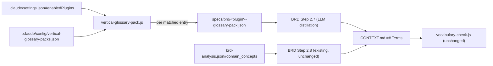

# Generalizing Vertical-Vocabulary Glossary Seeding

**Status:** Proposal (disposable architecture narrative, `/design --doc-only` — not an SDLC gate, not `specs/design/`)
**Date:** 2026-07-06
**Related:** `docs/superpowers/specs/2026-07-05-ubiquitous-language-design.md` (CONTEXT.md + `vocabulary-check.js` mechanism), `docs/superpowers/specs/2026-07-06-pe-ubiquitous-language-design.md` (PE-specific seeding, ships as `pe-glossary-pack.js` + BRD Step 2.7)

## Context & Problem Statement

The 2026-07-05 ubiquitous-language work gave the harness a domain-agnostic glossary mechanism: `CONTEXT.md` (`## Terms`, `### <Term>`) is written by BRD Step 2.8 from `brd-analysis.json#domain_concepts` and read by `/spec`, `/design`, `/implement`, and `generator.md`; `.claude/scripts/vocabulary-check.js` is the deterministic sensor that catches an entity/model name with no matching glossary term. This path is already the correct, unmodified default for general/pure-tech projects with no vertical plugin installed.

On top of that, 2026-07-06 shipped `pe-glossary-pack.js` + BRD Step 2.7: when the `private-equity` vertical plugin (from the `claude-for-financial-services` marketplace) is enabled, a script reads the plugin's own `skills/*/SKILL.md` frontmatter, groups the skills under a fixed 3-entry bounded-context table (`Deal Lifecycle`, `Investment Decision & Returns`, `Portfolio Operations & Value Creation`), and writes `specs/brd/pe-glossary-pack.json`; Step 2.7 then distills that into `CONTEXT.md` before Step 2.8 layers project-specific concepts on top. That design's own "Out of Scope" section explicitly deferred generalizing beyond private-equity: *"Extending this pattern to other vertical plugins ... is a future amendment if a second vertical customer needs it."*

That future amendment is now in scope. The installed `claude-for-financial-services` marketplace ships six more vertical plugins beyond private-equity — `financial-analysis`, `investment-banking`, `equity-research`, `wealth-management`, `fund-admin`, `operations` (confirmed via `~/.claude/plugins/marketplaces/claude-for-financial-services/.claude-plugin/marketplace.json`) — each with its own `skills/*/SKILL.md` inventory that encodes real domain vocabulary (e.g. `fund-admin`'s `nav-tieout`, `gl-recon`, `roll-forward`; `investment-banking`'s `cim-builder`, `merger-model`, `teaser`). Repeating `pe-glossary-pack.js`'s pattern as six more near-duplicate ~140-line scripts (plus six ~175-line test files) is exactly the kind of unrequested, speculative duplication CLAUDE.md's Simplicity-First principle warns against, and it does not extend to plugins from any other marketplace (e.g. a not-yet-existing insurance vertical).

**Goal of this proposal:** design one domain-agnostic seeding *mechanism*, parameterized by a small declarative registry, so adding a vertical is a config entry (human-reviewed data), not a new script. Confirm explicitly that projects with no vertical plugin keep today's exact behavior.

## Proposed Architecture

### Components

1. **`.claude/config/vertical-glossary-packs.json`** (new) — declarative registry. One entry per vertical plugin: plugin id, `enabledPlugins` match prefix, marketplace/cache skills subpaths, and its bounded-context table (name → skill-id list).
2. **`.claude/scripts/vertical-glossary-pack.js`** (new) — generic engine replacing `pe-glossary-pack.js`'s hardcoded constants with config-driven lookups. Same pure-core/CLI-wrapper shape (`isPluginEnabled`, `findSkillsDir`, `readSkillDescriptions`, `buildPack`), each function now takes a pack-config argument instead of reading module-level constants.
3. **`.claude/skills/brd/SKILL.md` Step 2.7** — reworded from "private-equity projects only" to "any enabled vertical plugin with a registered pack config," iterating over every registry entry whose plugin key is present and truthy in `.claude/settings.json#enabledPlugins`.
4. **`harness-manifest.json`'s `vocabulary-check` sensor entry** — description reworded from "or, for private-equity projects, from pe-glossary-pack.js (Step 2.7)" to "or, for any enabled vertical plugin, from vertical-glossary-pack.js (Step 2.7)".
5. **Unchanged:** `vocabulary-check.js`, the `CONTEXT.md` template, and the `design/SKILL.md` / `implement/SKILL.md` / `generator.md` reads of `CONTEXT.md` — all already domain-agnostic (confirmed by the 2026-07-06 design's own "No Changes Required" section and by `vocabulary-check.js`'s implementation, which treats `CONTEXT.md` as a single glossary regardless of a term's origin).

### Data flow (per BRD run)

1. BRD Step 2.7 runs `node .claude/scripts/vertical-glossary-pack.js`.
2. The script loads `enabledPlugins` and `vertical-glossary-packs.json`.
3. For each registry entry, test its `enabled_plugin_prefix` against the enabled-plugins keys (a table-driven generalization of today's `isPrivateEquityEnabled`).
4. **No entries match** → exit 0, nothing written, message "no vertical glossary packs enabled." This is the plain/pure-tech path — externally identical to today's no-op, and identical if the registry file itself is absent (treated as zero entries, not an error, so older scaffold checkouts degrade gracefully).
5. **Entries match** → for each, locate its skills dir (marketplace path then cache path, same fallback order as today), read `SKILL.md` frontmatter, group under that entry's bounded-context table, write `specs/brd/<plugin-id>-glossary-pack.json`.
6. A matched entry whose skills dir is missing/empty reports its own stderr error and the script exits 2 overall — but packs from *other*, successfully-resolved entries are still written. A broken `financial-analysis` install must not silently swallow a working `wealth-management` pack when both are enabled.
7. Step 2.7's LLM step then reads every `specs/brd/*-glossary-pack.json` present, distills domain nouns from each skill description into `CONTEXT.md`'s `## Terms` (one `**<Bounded Context Name>**` grouping line + `### <Term>` entries per pack, as today). New: if two packs distill to the same normalized term name with differing definitions, both are flagged in the progress log rather than one silently overwriting the other — a genuine cross-vertical vocabulary conflict is exactly what this step should surface, not hide.
8. Step 2.8 (unchanged) layers `domain_concepts` on top afterward, same as today.

### Key interfaces

Registry entry shape:

```json
{
  "plugin": "fund-admin",
  "enabled_plugin_prefix": "fund-admin@",
  "marketplace_skills_subpath": ".claude/plugins/marketplaces/claude-for-financial-services/plugins/vertical-plugins/fund-admin/skills",
  "cache_skills_subpath": ".claude/plugins/cache/claude-for-financial-services/fund-admin/skills",
  "bounded_contexts": [
    { "name": "Books & Close", "skills": ["gl-recon", "break-trace", "roll-forward", "accrual-schedule"] },
    { "name": "Investor Reporting", "skills": ["nav-tieout", "variance-commentary"] }
  ]
}
```

Output (unchanged shape from today's `pe-glossary-pack.json`, one file per matched vertical): `specs/brd/<plugin>-glossary-pack.json` → `{ "contexts": [{ "name", "skills": [{ "skill", "description" }] }] }`.

## Design Decisions & Trade-offs Considered

1. **Config-driven single engine vs. one script per vertical (status quo pattern).** Chosen: single generic engine + registry. Rejected repeating `pe-glossary-pack.js` six more times — roughly 1,900 lines of near-identical script+test duplication, and every new vertical would need a full boilerplate PR review instead of a data-only diff. Trade-off accepted: the generic engine is one indirection layer removed from constants — acceptable, and mirrors how `harness-manifest.json` itself is a registry read by tooling rather than per-check hardcoding.

2. **Where bounded-context tables live: config vs. auto-derived from skill names.** Chosen: hand-authored config, one table per vertical, reviewed like any other PR. Rejected auto-derivation (clustering skill names/descriptions heuristically or via LLM): grouping is a judgment call about how a vertical's practitioners actually talk (deal-team vs. IC vs. operating-partner language for PE; books-and-close vs. investor-reporting language for fund-admin) — not a mechanical property of skill names. The original PE design made the same call for its 3-context table; auto-derivation risks plausible-looking but wrong groupings that get trusted silently. Consequence: adding a vertical to the registry stays a human-reviewed step by design, not a gap to close later.

3. **Multiple simultaneously-enabled vertical plugins.** Chosen: process every matched registry entry independently, one output file per plugin, merge into `CONTEXT.md` sequentially with a same-term/different-definition conflict flag. Rejected "first match wins" — a real project could plausibly enable more than one vertical plugin (e.g. `fund-admin` + `private-equity` on the same FSI-focused build).

4. **No vertical plugin installed (general/pure-tech default).** Chosen: byte-for-byte the same externally observable behavior as today — the script no-ops and `domain_concepts` (Step 2.8) remains the sole `CONTEXT.md` source. This is the majority path for the harness and must never regress or add overhead; a missing or malformed registry file degrades to "zero entries," never an error that could block a plain project's BRD.

5. **Backward compatibility with the shipped private-equity pack.** Chosen: migrate `pe-glossary-pack.js`'s constants (`ENABLED_PLUGIN_RE`, both skills subpaths, `BOUNDED_CONTEXTS`) verbatim into the registry's first entry (`plugin: "private-equity"`). `test/pe-glossary-pack.test.js` is re-targeted at the generic engine parameterized with that entry, preserving every existing assertion (bounded-context assignment, exit codes, no-op path) rather than discarding test intent. The output filename changes from `pe-glossary-pack.json` to `private-equity-glossary-pack.json` for consistency across all verticals — a deliberate one-time breaking rename, called out explicitly in rollout, updating the BRD Step 2.7 prose accordingly. `pe-ic-memo` needs no change: it already reads `CONTEXT.md`, never the pack file directly.

6. **Insurance / other adjacent, not-yet-installed domains.** Chosen: no special-casing. The registry + generic-engine design is marketplace-agnostic — the two subpath fields are arbitrary paths, so any future vertical plugin (insurance or otherwise, from any marketplace) is addable with one new registry entry, zero script changes. Explicitly **not** built now: no insurance vertical plugin is installed on this machine or listed in the `claude-for-financial-services` marketplace today (`marketplace.json` lists `financial-analysis`, `investment-banking`, `equity-research`, `private-equity`, `wealth-management`, `fund-admin`, `operations`, plus several agent-plugins — no insurance entry). Adding a registry entry with nothing real to seed it from would violate CLAUDE.md's "no unrequested features" principle; this proposal only guarantees the mechanism won't block that addition later.

## Bounded-context tables to author per FSI vertical (data, not code — pending human review)

Skill inventories observed directly from the installed marketplace, for scoping the registry-authoring work only — the grouping itself is the human judgment call from Decision 2, not proposed here:

- `financial-analysis`: `3-statement-model`, `comps-analysis`, `clean-data-xls`, `xlsx-author`, `ppt-template-creator`, `deck-refresh`, `ib-check-deck`, `competitive-analysis`, `lbo-model`, `pptx-author`, `dcf-model`, `audit-xls` (excludes `skill-creator` — see note below)
- `investment-banking`: `cim-builder`, `merger-model`, `deal-tracker`, `process-letter`, `pitch-deck`, `teaser`, `datapack-builder`, `strip-profile`, `buyer-list`
- `equity-research`: `earnings-preview`, `thesis-tracker`, `morning-note`, `earnings-analysis`, `model-update`, `idea-generation`, `sector-overview`, `catalyst-calendar`, `initiating-coverage`
- `wealth-management`: `client-report`, `tax-loss-harvesting`, `client-review`, `portfolio-rebalance`, `investment-proposal`, `financial-plan`
- `fund-admin`: `nav-tieout`, `accrual-schedule`, `gl-recon`, `variance-commentary`, `break-trace`, `roll-forward`
- `operations`: `kyc-doc-parse`, `kyc-rules`

Note: `financial-analysis`'s skills directory also contains `skill-creator` — a meta-skill that authors other skills, not a source of domain vocabulary — the registry author should exclude it from that vertical's bounded-context table (mirrors how this repo's own top-level `skill-creator` skill is likewise not a glossary contributor).

## Rollout Path

**Phase 1 — Generalize the mechanism, migrate private-equity only (no new verticals yet).**
- Add `.claude/config/vertical-glossary-packs.json` with a single `private-equity` entry, values copied verbatim from `pe-glossary-pack.js`.
- Add `.claude/scripts/vertical-glossary-pack.js` (generic engine); delete `pe-glossary-pack.js` only after the migrated tests are green.
- Re-target `test/pe-glossary-pack.test.js` (or rename to `test/vertical-glossary-pack.test.js`) at the generic engine + private-equity entry, keeping every current assertion.
- Update BRD `SKILL.md` Step 2.7 wording and the `harness-manifest.json` `vocabulary-check` description.
- Gate on full `npm test` green, including the no-op-when-nothing-enabled and exit-2-on-broken-install cases, now expressed per registry entry.

**Phase 2 — Add registry entries for the six remaining FSI verticals, one PR each.**
- `financial-analysis`, `investment-banking`, `equity-research`, `wealth-management`, `fund-admin`, `operations` — independent of each other; ship in any order, any subset, based on actual customer demand.
- Each PR: author and review the bounded-context table (human judgment), add the registry entry, no script changes. Test surface per vertical is a config-shape assertion plus one integration test (parameterizing the existing CLI-integration test pattern) — not a new test file architecture.

**Phase 3 — Documentation hygiene.**
- Add a forward reference from the 2026-07-06 PE design's "Out of Scope" line to this document once approved.
- No new `harness-manifest.json` sensor entries — same as the original PE design, this is a seeding mechanism upstream of the existing `vocabulary-check` gate, not a new gate itself.

**Phase 4 — Future, unscheduled.** Adjacent domains (insurance, etc.) become addable the moment a real vertical plugin exists for them, via a Phase-2-style single-entry PR. No harness change required at that point.

## Risks, Dependencies, Open Questions

**Risks**
- Bounded-context table quality is only as good as its human author (the same risk the PE design already accepted for its 3-context table) — a poor grouping degrades glossary readability but doesn't break `vocabulary-check.js`, which only checks term presence, not grouping.
- Multi-vertical merge conflicts (same term, different definition, two enabled verticals) are a new failure mode this proposal introduces — mitigated by explicit flagging in Step 2.7, not auto-resolution, per Decision 3.
- Marketplace path drift (an already-accepted risk in the PE design) now multiplies across up to seven verticals; mitigated identically — each entry fails independently and loudly (exit 2 for that entry only, others unaffected).

**Dependencies**
- Requires the 2026-07-05 ubiquitous-language mechanism (`CONTEXT.md`, `vocabulary-check.js`) unchanged — confirmed domain-agnostic.
- Requires `.claude/settings.json#enabledPlugins` to remain the single source of truth for plugin state, per CLAUDE.md's Prompt Caching rule 1 (don't churn tools/plugins mid-session; settle `enabledPlugins` before long runs).

**Open questions for the human approving this before it becomes a real implementation plan**
- Should Phase 2's six vertical entries ship together or independently, gated by actual customer demand? Recommend independently — this is planning for optionality, not a commitment to build all six now.
- Should the private-equity pack's output filename rename (`pe-glossary-pack.json` → `private-equity-glossary-pack.json`) land in Phase 1? Recommend yes, now — it's a `specs/brd/` runtime artifact with no external consumers to break, and doing it before a second vertical ships avoids a permanent one-off naming exception.

## Data Flow


