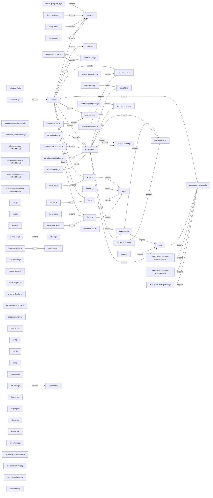

# Dependency Graph

```mermaid
flowchart LR
    js_eslint_config_js["eslint.config.js"]
    js_symphony_clone_scripts_create_group_issue_js["create-group-issue.js"]
    js_symphony_clone_scripts_diagnose_linear_js["diagnose-linear.js"]
    js_symphony_clone_src_config_js["config.js"]
    js_symphony_clone_src_config_test_js["config.test.js"]
    js_symphony_clone_src_index_js["index.js"]
    js_symphony_clone_src_index_test_js["index.test.js"]
    js_symphony_clone_src_observability_logger_js["logger.js"]
    js_symphony_clone_src_observability_status_server_js["status-server.js"]
    js_symphony_clone_src_orchestrator_claude_runner_js["claude-runner.js"]
    js_symphony_clone_src_orchestrator_claude_runner_test_js["claude-runner.test.js"]
    js_symphony_clone_src_orchestrator_eligibility_js["eligibility.js"]
    js_symphony_clone_src_orchestrator_eligibility_test_js["eligibility.test.js"]
    js_symphony_clone_src_orchestrator_outcomes_js["outcomes.js"]
    js_symphony_clone_src_orchestrator_outcomes_test_js["outcomes.test.js"]
    js_symphony_clone_src_orchestrator_planning_prompt_js["planning-prompt.js"]
    js_symphony_clone_src_orchestrator_planning_prompt_test_js["planning-prompt.test.js"]
    js_symphony_clone_src_orchestrator_pr_js["pr.js"]
    js_symphony_clone_src_orchestrator_pr_test_js["pr.test.js"]
    js_symphony_clone_src_orchestrator_prompt_builder_js["prompt-builder.js"]
    js_symphony_clone_src_orchestrator_result_reader_js["result-reader.js"]
    js_symphony_clone_src_orchestrator_scheduler_js["scheduler.js"]
    js_symphony_clone_src_orchestrator_scheduler_test_js["scheduler.test.js"]
    js_symphony_clone_src_orchestrator_state_store_js["state-store.js"]
    js_symphony_clone_src_orchestrator_workspace_manager_js["workspace-manager.js"]
    js_symphony_clone_src_tracker_azure_js["azure.js"]
    js_symphony_clone_src_tracker_azure_test_js["azure.test.js"]
    js_symphony_clone_src_tracker_http_js["http.js"]
    js_symphony_clone_src_tracker_http_test_js["http.test.js"]
    js_symphony_clone_src_tracker_jira_js["jira.js"]
    js_symphony_clone_src_tracker_jira_test_js["jira.test.js"]
    js_symphony_clone_src_tracker_linear_js["linear.js"]
    js_symphony_clone_src_tracker_linear_test_js["linear.test.js"]
    js_symphony_clone_test_config_test_js["config.test.js"]
    js_symphony_clone_test_feature_routing_docs_test_js["feature-routing-docs.test.js"]
    js_symphony_clone_test_linear_state_test_js["linear-state.test.js"]
    js_symphony_clone_test_prompt_builder_test_js["prompt-builder.test.js"]
    js_symphony_clone_test_result_reader_test_js["result-reader.test.js"]
    js_symphony_clone_test_scheduler_resume_test_js["scheduler-resume.test.js"]
    js_symphony_clone_test_scheduler_routing_test_js["scheduler-routing.test.js"]
    js_symphony_clone_test_scheduler_test_js["scheduler.test.js"]
    js_symphony_clone_test_state_store_test_js["state-store.test.js"]
    js_symphony_clone_test_status_server_test_js["status-server.test.js"]
    js_symphony_clone_test_workspace_manager_recovery_test_js["workspace-manager-recovery.test.js"]
    js_symphony_clone_test_workspace_manager_security_test_js["workspace-manager-security.test.js"]
    js_symphony_clone_test_workspace_manager_test_js["workspace-manager.test.js"]
    js_test_accessibility_contract_test_js["accessibility-contract.test.js"]
    js_test_adherence_critic_contract_test_js["adherence-critic-contract.test.js"]
    js_test_adversarial_fixtures_contract_test_js["adversarial-fixtures-contract.test.js"]
    js_test_adversarial_live_e2e_contract_test_js["adversarial-live-e2e-contract.test.js"]
    js_test_agent_readiness_wiring_contract_test_js["agent-readiness-wiring-contract.test.js"]
    js_test_e2e_brownfield_run_output_calc_js["calc.js"]
    js_test_e2e_feature_output_calc_js["calc.js"]
    js_test_e2e_fixtures_adversarial_brownfield_file_ledger_src_ledger_js["ledger.js"]
    js_test_e2e_fixtures_adversarial_brownfield_legacy_expressish_src_public_api_js["public-api.js"]
    js_test_e2e_fixtures_adversarial_brownfield_legacy_expressish_src_router_js["router.js"]
    js_test_e2e_helpers_alter_and_verify_js["alter-and-verify.js"]
    js_test_e2e_helpers_app_runtime_js["app-runtime.js"]
    js_test_e2e_helpers_claude_runner_js["claude-runner.js"]
    js_test_e2e_helpers_fresh_project_js["fresh-project.js"]
    js_test_e2e_helpers_grafana_checker_js["grafana-checker.js"]
    js_test_e2e_helpers_project_suite_js["project-suite.js"]
    js_test_e2e_helpers_prometheus_checker_js["prometheus-checker.js"]
    js_test_e2e_helpers_specs_summary_js["specs-summary.js"]
    js_test_e2e_run_pack_js["run-pack.js"]
    js_test_e2e_vibe_output_calc_js["calc.js"]
    js_test_evals_fixtures_calc_app_calc_js["calc.js"]
    js_test_evals_fixtures_clean_app_app_js["app.js"]
    js_test_evals_helpers_assertions_js["assertions.js"]
    js_test_evals_helpers_transcript_js["transcript.js"]
    js_test_evals_run_evals_js["run-evals.js"]
    cs_test_fixtures_code_index_enterprise_core_Service_cs["Service.cs"]
    java_test_fixtures_code_index_enterprise_src_main_java_com_acme_util_Helper_java["Helper.java"]
    js_test_fixtures_code_index_sample_src_Users_jsx["Users.jsx"]
    ts_test_fixtures_code_index_sample_src_components_Button_tsx["Button.tsx"]
    js_test_helpers_hook_fixture_js["hook-fixture.js"]
    js_test_helpers_pipeline_status_fixtures_js["pipeline-status-fixtures.js"]
    js_test_helpers_pre_commit_fixtures_js["pre-commit-fixtures.js"]
    js_test_helpers_record_run_fixture_js["record-run-fixture.js"]
    js_test_helpers_skill_corpus_js["skill-corpus.js"]
    js_symphony_clone_scripts_create_group_issue_js -->|imports| js_symphony_clone_src_config_js
    js_symphony_clone_scripts_diagnose_linear_js -->|imports| js_symphony_clone_src_config_js
    js_symphony_clone_src_config_test_js -->|imports| js_symphony_clone_src_config_js
    js_symphony_clone_src_index_js -->|imports| js_symphony_clone_src_config_js
    js_symphony_clone_src_index_js -->|imports| js_symphony_clone_src_tracker_linear_js
    js_symphony_clone_src_index_js -->|imports| js_symphony_clone_src_tracker_jira_js
    js_symphony_clone_src_index_js -->|imports| js_symphony_clone_src_tracker_azure_js
    js_symphony_clone_src_index_js -->|imports| js_symphony_clone_src_orchestrator_workspace_manager_js
    js_symphony_clone_src_index_js -->|imports| js_symphony_clone_src_orchestrator_claude_runner_js
    js_symphony_clone_src_index_js -->|imports| js_symphony_clone_src_orchestrator_scheduler_js
    js_symphony_clone_src_index_js -->|imports| js_symphony_clone_src_orchestrator_state_store_js
    js_symphony_clone_src_index_js -->|imports| js_symphony_clone_src_observability_logger_js
    js_symphony_clone_src_index_js -->|imports| js_symphony_clone_src_observability_status_server_js
    js_symphony_clone_src_index_test_js -->|imports| js_symphony_clone_src_index_js
    js_symphony_clone_src_orchestrator_claude_runner_test_js -->|imports| js_symphony_clone_src_orchestrator_claude_runner_js
    js_symphony_clone_src_orchestrator_eligibility_test_js -->|imports| js_symphony_clone_src_orchestrator_eligibility_js
    js_symphony_clone_src_orchestrator_outcomes_js -->|imports| js_symphony_clone_src_orchestrator_pr_js
    js_symphony_clone_src_orchestrator_outcomes_js -->|imports| js_symphony_clone_src_orchestrator_result_reader_js
    js_symphony_clone_src_orchestrator_outcomes_test_js -->|imports| js_symphony_clone_src_orchestrator_outcomes_js
    js_symphony_clone_src_orchestrator_planning_prompt_test_js -->|imports| js_symphony_clone_src_orchestrator_planning_prompt_js
    js_symphony_clone_src_orchestrator_pr_js -->|imports| js_symphony_clone_src_orchestrator_workspace_manager_js
    js_symphony_clone_src_orchestrator_pr_test_js -->|imports| js_symphony_clone_src_orchestrator_pr_js
    js_symphony_clone_src_orchestrator_scheduler_js -->|imports| js_symphony_clone_src_orchestrator_prompt_builder_js
    js_symphony_clone_src_orchestrator_scheduler_js -->|imports| js_symphony_clone_src_orchestrator_planning_prompt_js
    js_symphony_clone_src_orchestrator_scheduler_js -->|imports| js_symphony_clone_src_orchestrator_result_reader_js
    js_symphony_clone_src_orchestrator_scheduler_js -->|imports| js_symphony_clone_src_orchestrator_pr_js
    js_symphony_clone_src_orchestrator_scheduler_js -->|imports| js_symphony_clone_src_orchestrator_eligibility_js
    js_symphony_clone_src_orchestrator_scheduler_js -->|imports| js_symphony_clone_src_orchestrator_outcomes_js
    js_symphony_clone_src_orchestrator_scheduler_test_js -->|imports| js_symphony_clone_src_orchestrator_scheduler_js
    js_symphony_clone_src_tracker_azure_js -->|imports| js_symphony_clone_src_tracker_http_js
    js_symphony_clone_src_tracker_azure_test_js -->|imports| js_symphony_clone_src_tracker_azure_js
    js_symphony_clone_src_tracker_http_test_js -->|imports| js_symphony_clone_src_tracker_http_js
    js_symphony_clone_src_tracker_jira_js -->|imports| js_symphony_clone_src_tracker_http_js
    js_symphony_clone_src_tracker_jira_test_js -->|imports| js_symphony_clone_src_tracker_jira_js
    js_symphony_clone_src_tracker_linear_js -->|imports| js_symphony_clone_src_tracker_http_js
    js_symphony_clone_src_tracker_linear_test_js -->|imports| js_symphony_clone_src_tracker_linear_js
    js_symphony_clone_test_config_test_js -->|imports| js_symphony_clone_src_config_js
    js_symphony_clone_test_linear_state_test_js -->|imports| js_symphony_clone_src_tracker_linear_js
    js_symphony_clone_test_prompt_builder_test_js -->|imports| js_symphony_clone_src_orchestrator_prompt_builder_js
    js_symphony_clone_test_prompt_builder_test_js -->|imports| js_symphony_clone_src_orchestrator_claude_runner_js
    js_symphony_clone_test_result_reader_test_js -->|imports| js_symphony_clone_src_orchestrator_result_reader_js
    js_symphony_clone_test_scheduler_resume_test_js -->|imports| js_symphony_clone_src_orchestrator_scheduler_js
    js_symphony_clone_test_scheduler_routing_test_js -->|imports| js_symphony_clone_src_orchestrator_scheduler_js
    js_symphony_clone_test_scheduler_test_js -->|imports| js_symphony_clone_src_orchestrator_scheduler_js
    js_symphony_clone_test_state_store_test_js -->|imports| js_symphony_clone_src_orchestrator_state_store_js
    js_symphony_clone_test_status_server_test_js -->|imports| js_symphony_clone_src_observability_status_server_js
    js_symphony_clone_test_workspace_manager_recovery_test_js -->|imports| js_symphony_clone_src_orchestrator_workspace_manager_js
    js_symphony_clone_test_workspace_manager_security_test_js -->|imports| js_symphony_clone_src_orchestrator_workspace_manager_js
    js_symphony_clone_test_workspace_manager_test_js -->|imports| js_symphony_clone_src_orchestrator_workspace_manager_js
    js_test_e2e_fixtures_adversarial_brownfield_legacy_expressish_src_public_api_js -->|imports| js_test_e2e_fixtures_adversarial_brownfield_legacy_expressish_src_router_js
    js_test_e2e_helpers_alter_and_verify_js -->|imports| js_test_e2e_helpers_project_suite_js
    js_test_evals_run_evals_js -->|imports| js_test_evals_helpers_assertions_js
```

_Graph rendered with top 80 hubs by fan-in. Full graph: `code-graph.json` (346 nodes, 164 internal edges)._
