# `test/e2e/` — 18 module(s)

18 module(s).

## Dependencies

```mermaid
flowchart LR
  n_js_test_e2e_harness_adversarial_fixtures_test_js["harness-adversarial-fixtures.test.js"]
  n_js_test_e2e_harness_adversarial_live_test_js["harness-adversarial-live.test.js"]
  n_js_test_e2e_harness_auto_run_test_js["harness-auto-run.test.js"]
  n_js_test_e2e_harness_brownfield_run_test_js["harness-brownfield-run.test.js"]
  n_js_test_e2e_harness_brownfield_test_js["harness-brownfield.test.js"]
  n_js_test_e2e_harness_feature_route_test_js["harness-feature-route.test.js"]
  n_js_test_e2e_harness_framework_test_js["harness-framework.test.js"]
  n_js_test_e2e_harness_full_auto_run_test_js["harness-full-auto-run.test.js"]
  n_js_test_e2e_harness_gated_build_test_js["harness-gated-build.test.js"]
  n_js_test_e2e_harness_native_commands_test_js["harness-native-commands.test.js"]
  n_js_test_e2e_harness_pipeline_build_test_js["harness-pipeline-build.test.js"]
  n_js_test_e2e_harness_pipeline_test_js["harness-pipeline.test.js"]
  n_js_test_e2e_harness_plan_only_test_js["harness-plan-only.test.js"]
  n_js_test_e2e_harness_real_workflow_test_js["harness-real-workflow.test.js"]
  n_js_test_e2e_harness_selfheal_smoke_test_js["harness-selfheal-smoke.test.js"]
  n_js_test_e2e_harness_semi_auto_run_test_js["harness-semi-auto-run.test.js"]
  n_js_test_e2e_harness_vibe_run_test_js["harness-vibe-run.test.js"]
  n_js_test_e2e_run_pack_js["run-pack.js"]
```

## `js:test/e2e/harness-adversarial-fixtures.test.js`

- fan-in: 0, fan-out: 5

### Symbols
  - `loadManifest` (function) → js:test/e2e/harness-adversarial-fixtures.test.js:12 — `function loadManifest()`

## `js:test/e2e/harness-adversarial-live.test.js`

- fan-in: 0, fan-out: 7

### Symbols
  - `loadManifest` (function) → js:test/e2e/harness-adversarial-live.test.js:17 — `function loadManifest()`
  - `copyFixture` (function) → js:test/e2e/harness-adversarial-live.test.js:21 — `function copyFixture(sourceDir, targetDir)`
  - `readContract` (function) → js:test/e2e/harness-adversarial-live.test.js:28 — `function readContract(projectDir)`
  - `runFixtureSuite` (function) → js:test/e2e/harness-adversarial-live.test.js:32 — `function runFixtureSuite(projectDir)`
  - `assertProtectedFilesStillExist` (function) → js:test/e2e/harness-adversarial-live.test.js:40 — `function assertProtectedFilesStillExist(projectDir, contract)`
  - `assertForbiddenPatternsAbsent` (function) → js:test/e2e/harness-adversarial-live.test.js:49 — `function assertForbiddenPatternsAbsent(projectDir, contract)`
  - `collectFiles` (function) → js:test/e2e/harness-adversarial-live.test.js:65 — `function collectFiles(dir, results)`
  - `logResult` (function) → js:test/e2e/harness-adversarial-live.test.js:74 — `function logResult(stage, data)`
  - `buildMutationPrompt` (function) → js:test/e2e/harness-adversarial-live.test.js:79 — `function buildMutationPrompt(scenario, contract)`

## `js:test/e2e/harness-auto-run.test.js`

- fan-in: 0, fan-out: 10

### Symbols
  _(no extracted symbols)_

## `js:test/e2e/harness-brownfield-run.test.js`

- fan-in: 0, fan-out: 7

### Symbols
  - `seedExistingProject` (function) → js:test/e2e/harness-brownfield-run.test.js:61 — `function seedExistingProject(resolved)`
  - `resetExistingProject` (function) → js:test/e2e/harness-brownfield-run.test.js:71 — `function resetExistingProject()`
  - `hasSeamsFile` (function) → js:test/e2e/harness-brownfield-run.test.js:82 — `function hasSeamsFile(bfDir)`

## `js:test/e2e/harness-brownfield.test.js`

- fan-in: 0, fan-out: 11

### Symbols
  - `fileExists` (function) → js:test/e2e/harness-brownfield.test.js:20 — `function fileExists(rel)`
  - `readArtifact` (function) → js:test/e2e/harness-brownfield.test.js:24 — `function readArtifact(rel)`
  - `logResult` (function) → js:test/e2e/harness-brownfield.test.js:28 — `function logResult(stage, data)`
  - `findFiles` (function) → js:test/e2e/harness-brownfield.test.js:36 — `function findFiles(dir, pattern)`

## `js:test/e2e/harness-feature-route.test.js`

- fan-in: 0, fan-out: 8

### Symbols
  - `resetExistingProject` (function) → js:test/e2e/harness-feature-route.test.js:22 — `function resetExistingProject()`

## `js:test/e2e/harness-framework.test.js`

- fan-in: 0, fan-out: 9

### Symbols
  - `logResult` (function) → js:test/e2e/harness-framework.test.js:18 — `function logResult(stage, data)`
  - `runHook` (function) → js:test/e2e/harness-framework.test.js:23 — `function runHook(hookName, stdinData, cwd)`

## `js:test/e2e/harness-full-auto-run.test.js`

- fan-in: 0, fan-out: 8

### Symbols
  _(no extracted symbols)_

## `js:test/e2e/harness-gated-build.test.js`

- fan-in: 0, fan-out: 7

### Symbols
  - `exists` (function) → js:test/e2e/harness-gated-build.test.js:22 — `function exists(rel)`

## `js:test/e2e/harness-native-commands.test.js`

- fan-in: 0, fan-out: 7

### Symbols
  - `fileExists` (function) → js:test/e2e/harness-native-commands.test.js:27 — `function fileExists(rel)`
  - `readArtifact` (function) → js:test/e2e/harness-native-commands.test.js:31 — `function readArtifact(rel)`
  - `logResult` (function) → js:test/e2e/harness-native-commands.test.js:35 — `function logResult(stage, data)`
  - `findSourceFiles` (function) → js:test/e2e/harness-native-commands.test.js:40 — `function findSourceFiles()`
  - `runSuite` (function) → js:test/e2e/harness-native-commands.test.js:58 — `function runSuite()`

## `js:test/e2e/harness-pipeline-build.test.js`

- fan-in: 0, fan-out: 8

### Symbols
  - `findFiles` (function) → js:test/e2e/harness-pipeline-build.test.js:21 — `function findFiles(dir, pattern)`
  - `logResult` (function) → js:test/e2e/harness-pipeline-build.test.js:35 — `function logResult(stage, data)`

## `js:test/e2e/harness-pipeline.test.js`

- fan-in: 0, fan-out: 11

### Symbols
  - `fileExists` (function) → js:test/e2e/harness-pipeline.test.js:25 — `function fileExists(relativePath)`
  - `readArtifact` (function) → js:test/e2e/harness-pipeline.test.js:29 — `function readArtifact(relativePath)`
  - `logResult` (function) → js:test/e2e/harness-pipeline.test.js:33 — `function logResult(stage, data)`
  - `findFiles` (function) → js:test/e2e/harness-pipeline.test.js:39 — `function findFiles(dir, pattern)`
  - `findFilesInProject` (function) → js:test/e2e/harness-pipeline.test.js:53 — `function findFilesInProject(relativePath, pattern)`
  - `probeUrl` (function) → js:test/e2e/harness-pipeline.test.js:57 — `function probeUrl(url)`

## `js:test/e2e/harness-plan-only.test.js`

- fan-in: 0, fan-out: 8

### Symbols
  - `resetProject` (function) → js:test/e2e/harness-plan-only.test.js:28 — `function resetProject()`

## `js:test/e2e/harness-real-workflow.test.js`

- fan-in: 0, fan-out: 8

### Symbols
  - `logResult` (function) → js:test/e2e/harness-real-workflow.test.js:15 — `function logResult(stage, data)`
  - `exists` (function) → js:test/e2e/harness-real-workflow.test.js:20 — `function exists(rel)`
  - `read` (function) → js:test/e2e/harness-real-workflow.test.js:24 — `function read(rel)`
  - `listFiles` (function) → js:test/e2e/harness-real-workflow.test.js:28 — `function listFiles(rel, predicate = () => true)`
  - `assertArtifact` (function) → js:test/e2e/harness-real-workflow.test.js:34 — `function assertArtifact(rel, label)`

## `js:test/e2e/harness-selfheal-smoke.test.js`

- fan-in: 0, fan-out: 8

### Symbols
  - `stepTimeout` (function) → js:test/e2e/harness-selfheal-smoke.test.js:48 — `function stepTimeout(preferredMs)`
  - `logResult` (function) → js:test/e2e/harness-selfheal-smoke.test.js:54 — `function logResult(label, data)`
  - `claudeOpts` (function) → js:test/e2e/harness-selfheal-smoke.test.js:59 — `function claudeOpts()`
  - `requestRepair` (function) → js:test/e2e/harness-selfheal-smoke.test.js:65 — `function requestRepair(fixGoal, diagnostics)`
  - `attemptVerify` (function) → js:test/e2e/harness-selfheal-smoke.test.js:75 — `async function attemptVerify(label, steps, attempt)`
  - `verifyWithFix` (function) → js:test/e2e/harness-selfheal-smoke.test.js:91 — `async function verifyWithFix({ label, steps, fixGoal })`
  - `prepareProjectDir` (function) → js:test/e2e/harness-selfheal-smoke.test.js:106 — `function prepareProjectDir()`
  - `runScaffold` (function) → js:test/e2e/harness-selfheal-smoke.test.js:121 — `function runScaffold()`
  - `runBuild` (function) → js:test/e2e/harness-selfheal-smoke.test.js:137 — `function runBuild()`
  - `scaffoldAndBuild` (function) → js:test/e2e/harness-selfheal-smoke.test.js:147 — `function scaffoldAndBuild()`

## `js:test/e2e/harness-semi-auto-run.test.js`

- fan-in: 0, fan-out: 9

### Symbols
  - `hasRootPackage` (function) → js:test/e2e/harness-semi-auto-run.test.js:30 — `function hasRootPackage()`

## `js:test/e2e/harness-vibe-run.test.js`

- fan-in: 0, fan-out: 8

### Symbols
  - `seedExistingProject` (function) → js:test/e2e/harness-vibe-run.test.js:59 — `function seedExistingProject(resolved)`
  - `resetExistingProject` (function) → js:test/e2e/harness-vibe-run.test.js:70 — `function resetExistingProject()`

## `js:test/e2e/run-pack.js`

- fan-in: 1, fan-out: 3

### Symbols
  - `layer` (function) → js:test/e2e/run-pack.js:61 — `function layer(id, name, timeoutSec, command, opts = {})`
  - `installBrowserLayer` (function) → js:test/e2e/run-pack.js:65 — `function installBrowserLayer()`
  - `telemetryLayer` (function) → js:test/e2e/run-pack.js:69 — `function telemetryLayer()`
  - `parseArgs` (function) → js:test/e2e/run-pack.js:73 — `function parseArgs(argv)`
  - `splitCsv` (function) → js:test/e2e/run-pack.js:91 — `function splitCsv(value)`
  - `selectedLayers` (function) → js:test/e2e/run-pack.js:95 — `function selectedLayers(opts)`
  - `checkPrerequisites` (function) → js:test/e2e/run-pack.js:114 — `function checkPrerequisites(layers)`
  - `commandExists` (function) → js:test/e2e/run-pack.js:121 — `function commandExists(command)`
  - `spawnDetached` (function) → js:test/e2e/run-pack.js:129 — `function spawnDetached(command, timeoutSec, outFd, errFd)`
  - `runLayer` (function) → js:test/e2e/run-pack.js:150 — `function runLayer(l, opts = {})`
  - `printFailureTail` (function) → js:test/e2e/run-pack.js:179 — `function printFailureTail(record)`
  - `readTail` (function) → js:test/e2e/run-pack.js:187 — `function readTail(file, lines)`
  - `writeSummary` (function) → js:test/e2e/run-pack.js:195 — `function writeSummary(summary)`
  - `prereqFailure` (function) → js:test/e2e/run-pack.js:202 — `function prereqFailure(opts, prereqErrors)`
  - `runPack` (function) → js:test/e2e/run-pack.js:215 — `function runPack(opts)`
  - `listProfiles` (function) → js:test/e2e/run-pack.js:239 — `function listProfiles()`
  - `ensureTelemetry` (function) → js:test/e2e/run-pack.js:245 — `function ensureTelemetry()`
  - `httpHealthy` (function) → js:test/e2e/run-pack.js:260 — `function httpHealthy(url)`
  - `main` (function) → js:test/e2e/run-pack.js:265 — `function main(argv = process.argv.slice(2))`
