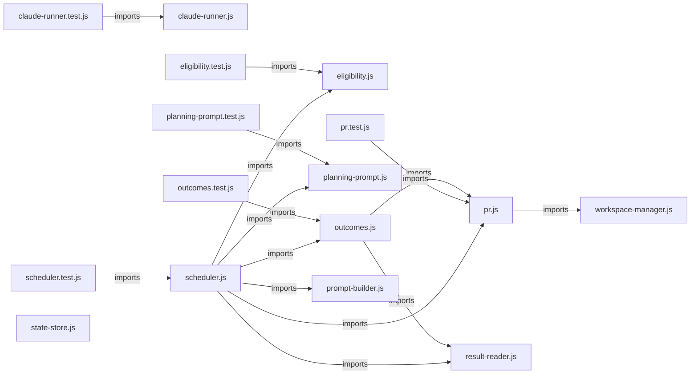

# `symphony_clone/src/orchestrator/` — 16 module(s)

16 module(s).

## Dependencies

## `js:symphony_clone/src/orchestrator/claude-runner.js`

- fan-in: 3, fan-out: 1

### Symbols
  - `ClaudeRunner` (class) → js:symphony_clone/src/orchestrator/claude-runner.js:5 — `class ClaudeRunner`
  - `spawnDetachedShell` (function) → js:symphony_clone/src/orchestrator/claude-runner.js:24 — `function spawnDetachedShell(commandWithPrompt, cwd)`
  - `killProcessGroup` (function) → js:symphony_clone/src/orchestrator/claude-runner.js:34 — `function killProcessGroup(child)`
  - `wireStreams` (function) → js:symphony_clone/src/orchestrator/claude-runner.js:42 — `function wireStreams(child)`
  - `runShellCommand` (function) → js:symphony_clone/src/orchestrator/claude-runner.js:55 — `function runShellCommand(command, options)`
  - `shellQuote` (function) → js:symphony_clone/src/orchestrator/claude-runner.js:85 — `function shellQuote(value)`

## `js:symphony_clone/src/orchestrator/claude-runner.test.js`

- fan-in: 0, fan-out: 6

### Symbols
  - `processAlive` (function) → js:symphony_clone/src/orchestrator/claude-runner.test.js:10 — `function processAlive(pid)`

## `js:symphony_clone/src/orchestrator/eligibility.js`

- fan-in: 2, fan-out: 0

### Symbols
  - `normalize` (function) → js:symphony_clone/src/orchestrator/eligibility.js:6 — `function normalize(value)`
  - `issueKind` (function) → js:symphony_clone/src/orchestrator/eligibility.js:11 — `function issueKind(issue, config)`
  - `isEligible` (function) → js:symphony_clone/src/orchestrator/eligibility.js:19 — `function isEligible(issue, config)`
  - `isStuck` (function) → js:symphony_clone/src/orchestrator/eligibility.js:27 — `function isStuck(issue, runningSet, config)`

## `js:symphony_clone/src/orchestrator/eligibility.test.js`

- fan-in: 0, fan-out: 3

### Symbols
  _(no extracted symbols)_

## `js:symphony_clone/src/orchestrator/outcomes.js`

- fan-in: 2, fan-out: 2

### Symbols
  - `finishExecution` (function) → js:symphony_clone/src/orchestrator/outcomes.js:10 — `async function finishExecution(sched, issue, group, workspace, runResult)`
  - `finishPlanning` (function) → js:symphony_clone/src/orchestrator/outcomes.js:22 — `async function finishPlanning(sched, issue, group, workspace, runResult)`
  - `completeHumanReview` (function) → js:symphony_clone/src/orchestrator/outcomes.js:42 — `async function completeHumanReview(sched, issue, group, workspace, runResult)`
  - `resolveReviewOutcome` (function) → js:symphony_clone/src/orchestrator/outcomes.js:58 — `async function resolveReviewOutcome(sched, issue, workspace, prUrl)`

## `js:symphony_clone/src/orchestrator/outcomes.test.js`

- fan-in: 0, fan-out: 3

### Symbols
  - `fakeSched` (function) → js:symphony_clone/src/orchestrator/outcomes.test.js:7 — `function fakeSched(overrides = {})`

## `js:symphony_clone/src/orchestrator/planning-prompt.js`

- fan-in: 2, fan-out: 0

### Symbols
  - `buildPlanningPrompt` (function) → js:symphony_clone/src/orchestrator/planning-prompt.js:36 — `function buildPlanningPrompt(issue)`

## `js:symphony_clone/src/orchestrator/planning-prompt.test.js`

- fan-in: 0, fan-out: 3

### Symbols
  _(no extracted symbols)_

## `js:symphony_clone/src/orchestrator/pr.js`

- fan-in: 3, fan-out: 1

### Symbols
  - `maybeCreatePr` (function) → js:symphony_clone/src/orchestrator/pr.js:8 — `async function maybeCreatePr(workspacePath, issue, group, config)`
  - `isRealPrUrl` (function) → js:symphony_clone/src/orchestrator/pr.js:23 — `function isRealPrUrl(prUrl)`
  - `repoSlugFromGitUrl` (function) → js:symphony_clone/src/orchestrator/pr.js:33 — `function repoSlugFromGitUrl(url)`
  - `repoSlugFromPrUrl` (function) → js:symphony_clone/src/orchestrator/pr.js:44 — `function repoSlugFromPrUrl(prUrl)`
  - `enableAutoMerge` (function) → js:symphony_clone/src/orchestrator/pr.js:52 — `async function enableAutoMerge(prUrl, cwd, config)`

## `js:symphony_clone/src/orchestrator/pr.test.js`

- fan-in: 0, fan-out: 3

### Symbols
  _(no extracted symbols)_

## `js:symphony_clone/src/orchestrator/prompt-builder.js`

- fan-in: 2, fan-out: 0

### Symbols
  - `resolveHarnessCommand` (function) → js:symphony_clone/src/orchestrator/prompt-builder.js:75 — `function resolveHarnessCommand(issue, group)`
  - `buildHarnessPrompt` (function) → js:symphony_clone/src/orchestrator/prompt-builder.js:88 — `function buildHarnessPrompt(issue, group)`
  - `buildFeaturePrompt` (function) → js:symphony_clone/src/orchestrator/prompt-builder.js:98 — `function buildFeaturePrompt(issue)`
  - `groupFromIssue` (function) → js:symphony_clone/src/orchestrator/prompt-builder.js:107 — `function groupFromIssue(issue)`

## `js:symphony_clone/src/orchestrator/result-reader.js`

- fan-in: 3, fan-out: 2

### Symbols
  - `readResult` (function) → js:symphony_clone/src/orchestrator/result-reader.js:6 — `async function readResult(workspacePath, groupId)`
  - `buildProofComment` (function) → js:symphony_clone/src/orchestrator/result-reader.js:21 — `function buildProofComment(issue, group, runResult, prUrl)`
  - `arrayOrEmpty` (function) → js:symphony_clone/src/orchestrator/result-reader.js:51 — `function arrayOrEmpty(value)`

## `js:symphony_clone/src/orchestrator/scheduler.js`

- fan-in: 7, fan-out: 6

### Symbols
  - `Scheduler` (class) → js:symphony_clone/src/orchestrator/scheduler.js:10 — `class Scheduler`
  - `safeTrackerCall` (function) → js:symphony_clone/src/orchestrator/scheduler.js:193 — `async function safeTrackerCall(promise, logger, issue)`

## `js:symphony_clone/src/orchestrator/scheduler.test.js`

- fan-in: 0, fan-out: 6

### Symbols
  - `humanReviewWorkspace` (function) → js:symphony_clone/src/orchestrator/scheduler.test.js:15 — `function humanReviewWorkspace(key)`
  - `makeDeps` (function) → js:symphony_clone/src/orchestrator/scheduler.test.js:26 — `function makeDeps(ws)`
  - `build` (function) → js:symphony_clone/src/orchestrator/scheduler.test.js:50 — `function build(d, config, enableAutoMergeFn)`
  - `plannedWorkspace` (function) → js:symphony_clone/src/orchestrator/scheduler.test.js:83 — `function plannedWorkspace(key, status = 'planned')`

## `js:symphony_clone/src/orchestrator/state-store.js`

- fan-in: 2, fan-out: 2

### Symbols
  - `StateStore` (class) → js:symphony_clone/src/orchestrator/state-store.js:6 — `class StateStore`
  - `loadState` (function) → js:symphony_clone/src/orchestrator/state-store.js:97 — `function loadState(statePath)`
  - `retryTime` (function) → js:symphony_clone/src/orchestrator/state-store.js:104 — `function retryTime(attempt, options)`

## `js:symphony_clone/src/orchestrator/workspace-manager.js`

- fan-in: 5, fan-out: 4

### Symbols
  - `WorkspaceManager` (class) → js:symphony_clone/src/orchestrator/workspace-manager.js:8 — `class WorkspaceManager`
  - `scrubbedGitEnv` (function) → js:symphony_clone/src/orchestrator/workspace-manager.js:73 — `function scrubbedGitEnv(env = process.env)`
  - `runGit` (function) → js:symphony_clone/src/orchestrator/workspace-manager.js:81 — `function runGit(runner, cwd, args)`
  - `exists` (function) → js:symphony_clone/src/orchestrator/workspace-manager.js:85 — `async function exists(filePath)`
  - `branchExists` (function) → js:symphony_clone/src/orchestrator/workspace-manager.js:94 — `async function branchExists(runner, cwd, branchName)`
  - `countCommitsAhead` (function) → js:symphony_clone/src/orchestrator/workspace-manager.js:104 — `async function countCommitsAhead(runner, cwd, branch, base)`
  - `buildRecoveryTag` (function) → js:symphony_clone/src/orchestrator/workspace-manager.js:110 — `function buildRecoveryTag(branchName, runMeta)`
  - `safeWorkspaceKey` (function) → js:symphony_clone/src/orchestrator/workspace-manager.js:116 — `function safeWorkspaceKey(value)`
  - `runCommand` (function) → js:symphony_clone/src/orchestrator/workspace-manager.js:130 — `function runCommand(command, args, options = {})`
