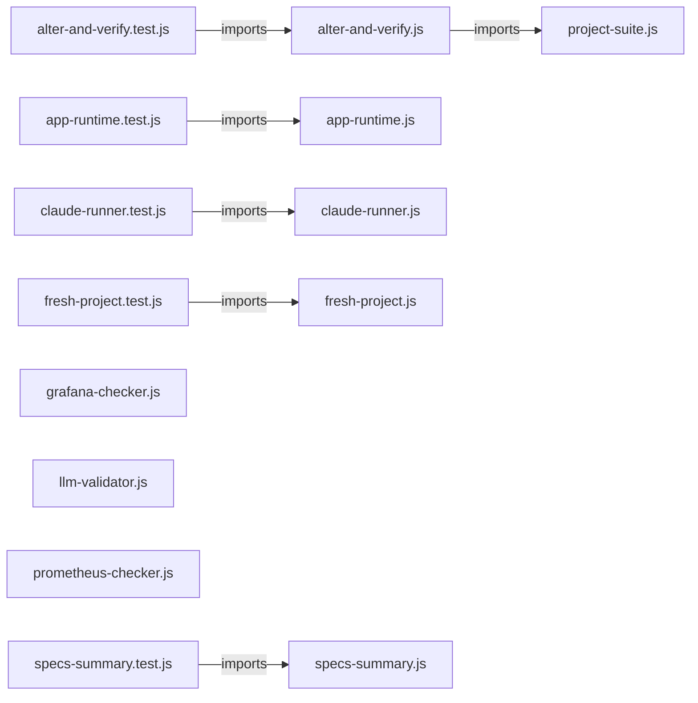

# `test/e2e/helpers/` — 14 module(s)

14 module(s).

## Dependencies

## `js:test/e2e/helpers/alter-and-verify.js`

- fan-in: 3, fan-out: 3

### Symbols
  - `alterAndVerify` (function) → js:test/e2e/helpers/alter-and-verify.js:17 — `function alterAndVerify(runClaude, baseOpts, { projectDir, changeDesc })`

## `js:test/e2e/helpers/alter-and-verify.test.js`

- fan-in: 0, fan-out: 6

### Symbols
  _(no extracted symbols)_

## `js:test/e2e/helpers/app-runtime.js`

- fan-in: 2, fan-out: 3

### Symbols
  - `sleepSync` (function) → js:test/e2e/helpers/app-runtime.js:17 — `function sleepSync(ms)`
  - `freePort` (function) → js:test/e2e/helpers/app-runtime.js:29 — `function freePort(port)`
  - `waitForPort` (function) → js:test/e2e/helpers/app-runtime.js:46 — `function waitForPort(port, host, timeoutMs)`
  - `startApp` (function) → js:test/e2e/helpers/app-runtime.js:66 — `async function startApp(projectDir, { port = DEFAULT_PORT, startTimeoutMs = 30000 } = {})`
  - `stopApp` (function) → js:test/e2e/helpers/app-runtime.js:87 — `function stopApp(handle)`
  - `assertInBrowser` (function) → js:test/e2e/helpers/app-runtime.js:102 — `async function assertInBrowser(baseUrl, steps, { screenshotPath } = {})`

## `js:test/e2e/helpers/app-runtime.test.js`

- fan-in: 0, fan-out: 9

### Symbols
  - `httpGetBody` (function) → js:test/e2e/helpers/app-runtime.test.js:14 — `function httpGetBody(url)`

## `js:test/e2e/helpers/claude-runner.js`

- fan-in: 17, fan-out: 4

### Symbols
  - `buildClaudeArgs` (function) → js:test/e2e/helpers/claude-runner.js:11 — `function buildClaudeArgs(model, budgetUsd, continueSession, pluginDir, sessionId, outputFormat)`
  - `buildClaudeEnv` (function) → js:test/e2e/helpers/claude-runner.js:36 — `function buildClaudeEnv()`
  - `runClaude` (function) → js:test/e2e/helpers/claude-runner.js:53 — `function runClaude(prompt, options = {})`
  - `readTextOr` (function) → js:test/e2e/helpers/claude-runner.js:72 — `function readTextOr(p, fallback)`
  - `spawnCapturedGroup` (function) → js:test/e2e/helpers/claude-runner.js:84 — `function spawnCapturedGroup(command, args, { input, cwd, timeoutMs, env })`

## `js:test/e2e/helpers/claude-runner.test.js`

- fan-in: 0, fan-out: 3

### Symbols
  _(no extracted symbols)_

## `js:test/e2e/helpers/fresh-project.js`

- fan-in: 5, fan-out: 3

### Symbols
  - `freshProject` (function) → js:test/e2e/helpers/fresh-project.js:13 — `function freshProject(projectDir, prdPath)`

## `js:test/e2e/helpers/fresh-project.test.js`

- fan-in: 0, fan-out: 5

### Symbols
  _(no extracted symbols)_

## `js:test/e2e/helpers/grafana-checker.js`

- fan-in: 3, fan-out: 1

### Symbols
  - `grafanaGet` (function) → js:test/e2e/helpers/grafana-checker.js:7 — `function grafanaGet(apiPath)`
  - `isGrafanaUp` (function) → js:test/e2e/helpers/grafana-checker.js:21 — `async function isGrafanaUp()`
  - `getDashboard` (function) → js:test/e2e/helpers/grafana-checker.js:30 — `async function getDashboard(uid)`
  - `listDashboards` (function) → js:test/e2e/helpers/grafana-checker.js:34 — `async function listDashboards()`

## `js:test/e2e/helpers/llm-validator.js`

- fan-in: 0, fan-out: 2

### Symbols
  - `llmValidate` (function) → js:test/e2e/helpers/llm-validator.js:6 — `function llmValidate(artifactPath, criteria)`

## `js:test/e2e/helpers/project-suite.js`

- fan-in: 9, fan-out: 3

### Symbols
  - `runProjectSuite` (function) → js:test/e2e/helpers/project-suite.js:10 — `function runProjectSuite(projectDir, timeoutMs = 120000)`

## `js:test/e2e/helpers/prometheus-checker.js`

- fan-in: 4, fan-out: 1

### Symbols
  - `queryPrometheus` (function) → js:test/e2e/helpers/prometheus-checker.js:7 — `function queryPrometheus(query)`
  - `assertMetricExists` (function) → js:test/e2e/helpers/prometheus-checker.js:21 — `async function assertMetricExists(query)`
  - `isPrometheusUp` (function) → js:test/e2e/helpers/prometheus-checker.js:30 — `function isPrometheusUp()`
  - `pollMetric` (function) → js:test/e2e/helpers/prometheus-checker.js:41 — `function pollMetric(query, intervalMs, timeoutMs)`

## `js:test/e2e/helpers/specs-summary.js`

- fan-in: 2, fan-out: 2

### Symbols
  - `readOr` (function) → js:test/e2e/helpers/specs-summary.js:21 — `function readOr(projectDir, rel, fallback)`
  - `countStories` (function) → js:test/e2e/helpers/specs-summary.js:26 — `function countStories(projectDir)`
  - `summarizeSpecs` (function) → js:test/e2e/helpers/specs-summary.js:33 — `function summarizeSpecs(projectDir)`
  - `formatSummary` (function) → js:test/e2e/helpers/specs-summary.js:49 — `function formatSummary(projectDir, s = summarizeSpecs(projectDir))`

## `js:test/e2e/helpers/specs-summary.test.js`

- fan-in: 0, fan-out: 6

### Symbols
  - `buildFakeSpecs` (function) → js:test/e2e/helpers/specs-summary.test.js:11 — `function buildFakeSpecs()`
