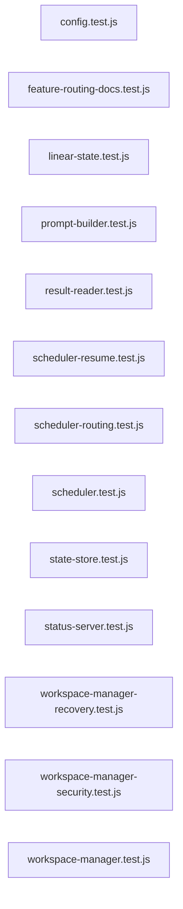

# `symphony_clone/test/` — 13 module(s)

13 module(s).

## Dependencies

## `js:symphony_clone/test/config.test.js`

- fan-in: 0, fan-out: 6

### Symbols
  _(no extracted symbols)_

## `js:symphony_clone/test/feature-routing-docs.test.js`

- fan-in: 0, fan-out: 4

### Symbols
  - `read` (function) → js:symphony_clone/test/feature-routing-docs.test.js:8 — `read = (rel) => fs.readFileSync(path.join(__dirname, '..', rel), 'utf8')`

## `js:symphony_clone/test/linear-state.test.js`

- fan-in: 0, fan-out: 3

### Symbols
  _(no extracted symbols)_

## `js:symphony_clone/test/prompt-builder.test.js`

- fan-in: 0, fan-out: 4

### Symbols
  _(no extracted symbols)_

## `js:symphony_clone/test/result-reader.test.js`

- fan-in: 0, fan-out: 6

### Symbols
  _(no extracted symbols)_

## `js:symphony_clone/test/scheduler-resume.test.js`

- fan-in: 0, fan-out: 6

### Symbols
  _(no extracted symbols)_

## `js:symphony_clone/test/scheduler-routing.test.js`

- fan-in: 0, fan-out: 3

### Symbols
  - `routingScheduler` (function) → js:symphony_clone/test/scheduler-routing.test.js:19 — `function routingScheduler()`

## `js:symphony_clone/test/scheduler.test.js`

- fan-in: 0, fan-out: 11

### Symbols
  _(no extracted symbols)_

## `js:symphony_clone/test/state-store.test.js`

- fan-in: 0, fan-out: 6

### Symbols
  _(no extracted symbols)_

## `js:symphony_clone/test/status-server.test.js`

- fan-in: 0, fan-out: 3

### Symbols
  - `captureResponse` (function) → js:symphony_clone/test/status-server.test.js:24 — `function captureResponse()`

## `js:symphony_clone/test/workspace-manager-recovery.test.js`

- fan-in: 0, fan-out: 6

### Symbols
  - `makeTempRoot` (function) → js:symphony_clone/test/workspace-manager-recovery.test.js:10 — `function makeTempRoot()`
  - `recordingRunner` (function) → js:symphony_clone/test/workspace-manager-recovery.test.js:14 — `function recordingRunner(handlers = {})`
  - `makeWm` (function) → js:symphony_clone/test/workspace-manager-recovery.test.js:26 — `function makeWm(workspaceRoot, runner)`
  - `seedExistingWorkspace` (function) → js:symphony_clone/test/workspace-manager-recovery.test.js:34 — `function seedExistingWorkspace(workspaceRoot, key = 'ENG-101')`

## `js:symphony_clone/test/workspace-manager-security.test.js`

- fan-in: 0, fan-out: 6

### Symbols
  - `makeTempRoot` (function) → js:symphony_clone/test/workspace-manager-security.test.js:10 — `function makeTempRoot()`
  - `recordingRunner` (function) → js:symphony_clone/test/workspace-manager-security.test.js:14 — `function recordingRunner(handlers = {})`

## `js:symphony_clone/test/workspace-manager.test.js`

- fan-in: 0, fan-out: 6

### Symbols
  - `makeTempRoot` (function) → js:symphony_clone/test/workspace-manager.test.js:10 — `function makeTempRoot()`
  - `recordingRunner` (function) → js:symphony_clone/test/workspace-manager.test.js:77 — `function recordingRunner(handlers = {})`
  - `gitError` (function) → js:symphony_clone/test/workspace-manager.test.js:219 — `function gitError(code, message)`
