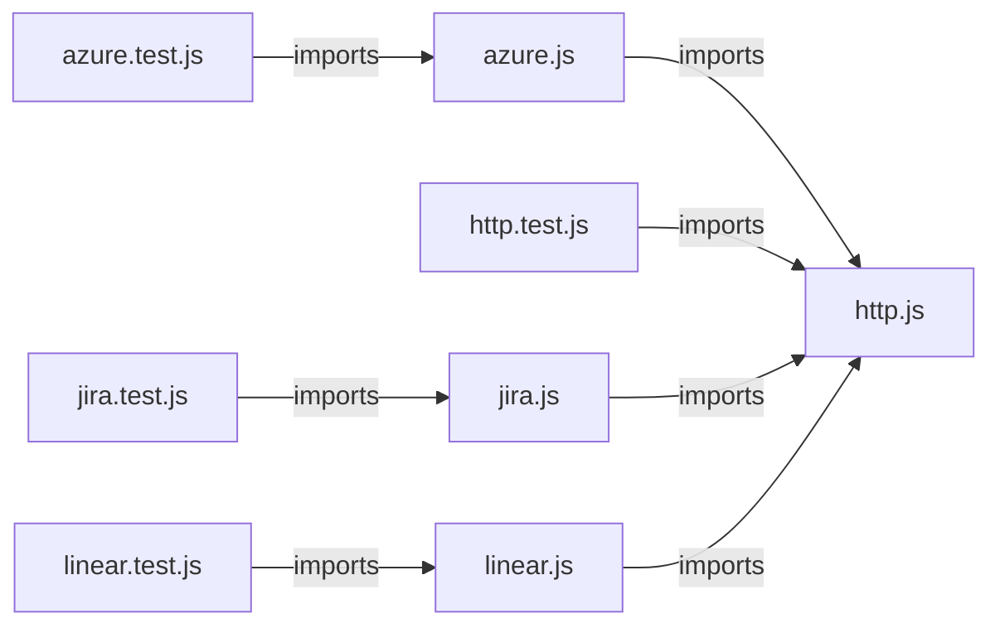

# `symphony_clone/src/tracker/` — 8 module(s)

8 module(s).

## Dependencies

## `js:symphony_clone/src/tracker/azure.js`

- fan-in: 2, fan-out: 1

### Symbols
  - `AzureDevOpsTracker` (class) → js:symphony_clone/src/tracker/azure.js:15 — `class AzureDevOpsTracker`
  - `normalizeAzureItem` (function) → js:symphony_clone/src/tracker/azure.js:90 — `function normalizeAzureItem(item, azure, blockerStates)`
  - `blockerIdsFromRelations` (function) → js:symphony_clone/src/tracker/azure.js:111 — `function blockerIdsFromRelations(relations)`
  - `workItemIdFromUrl` (function) → js:symphony_clone/src/tracker/azure.js:118 — `function workItemIdFromUrl(url)`
  - `parseTags` (function) → js:symphony_clone/src/tracker/azure.js:123 — `function parseTags(tags)`
  - `htmlToText` (function) → js:symphony_clone/src/tracker/azure.js:128 — `function htmlToText(html)`

## `js:symphony_clone/src/tracker/azure.test.js`

- fan-in: 0, fan-out: 3

### Symbols
  - `jsonResponse` (function) → js:symphony_clone/src/tracker/azure.test.js:12 — `function jsonResponse(payload, status = 200)`

## `js:symphony_clone/src/tracker/http.js`

- fan-in: 4, fan-out: 0

### Symbols
  - `restRequest` (function) → js:symphony_clone/src/tracker/http.js:11 — `async function restRequest(fetchImpl, url, { method, headers = {}, body, contentType = 'application/json', errorLabel = 'request' })`
  - `basicAuth` (function) → js:symphony_clone/src/tracker/http.js:27 — `function basicAuth(user, token)`
  - `truncate` (function) → js:symphony_clone/src/tracker/http.js:31 — `function truncate(text, max = MAX_ERROR_BODY)`
  - `normalize` (function) → js:symphony_clone/src/tracker/http.js:36 — `function normalize(value)`
  - `unique` (function) → js:symphony_clone/src/tracker/http.js:42 — `function unique(values)`

## `js:symphony_clone/src/tracker/http.test.js`

- fan-in: 0, fan-out: 3

### Symbols
  - `response` (function) → js:symphony_clone/src/tracker/http.test.js:7 — `function response(payload, { status = 200, text } = {})`

## `js:symphony_clone/src/tracker/jira.js`

- fan-in: 2, fan-out: 1

### Symbols
  - `JiraTracker` (class) → js:symphony_clone/src/tracker/jira.js:13 — `class JiraTracker`
  - `normalizeJiraIssue` (function) → js:symphony_clone/src/tracker/jira.js:58 — `function normalizeJiraIssue(issue, baseUrl)`
  - `blockedByFromLinks` (function) → js:symphony_clone/src/tracker/jira.js:77 — `function blockedByFromLinks(links)`
  - `adfToText` (function) → js:symphony_clone/src/tracker/jira.js:87 — `function adfToText(node)`
  - `walkAdf` (function) → js:symphony_clone/src/tracker/jira.js:95 — `function walkAdf(node, parts)`
  - `textToAdf` (function) → js:symphony_clone/src/tracker/jira.js:105 — `function textToAdf(text)`
  - `quoteJql` (function) → js:symphony_clone/src/tracker/jira.js:113 — `function quoteJql(value)`

## `js:symphony_clone/src/tracker/jira.test.js`

- fan-in: 0, fan-out: 3

### Symbols
  - `jsonResponse` (function) → js:symphony_clone/src/tracker/jira.test.js:12 — `function jsonResponse(payload, status = 200)`

## `js:symphony_clone/src/tracker/linear.js`

- fan-in: 3, fan-out: 1

### Symbols
  - `LinearTracker` (class) → js:symphony_clone/src/tracker/linear.js:5 — `class LinearTracker`
  - `normalizeLinearIssue` (function) → js:symphony_clone/src/tracker/linear.js:130 — `function normalizeLinearIssue(issue)`

## `js:symphony_clone/src/tracker/linear.test.js`

- fan-in: 0, fan-out: 3

### Symbols
  _(no extracted symbols)_
