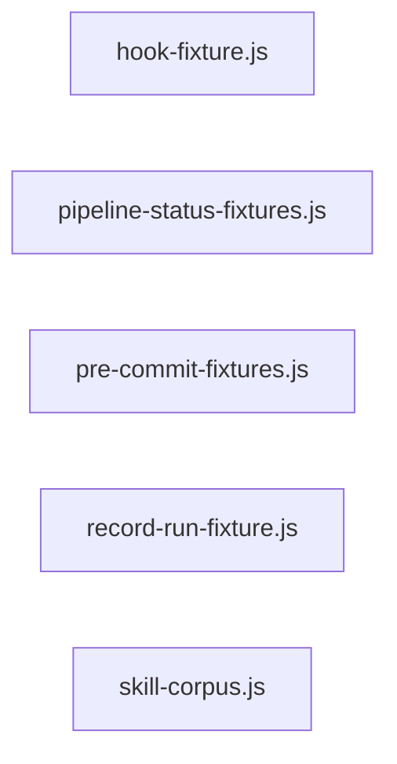

# `test/helpers/` — 5 module(s)

5 module(s).

## Dependencies

## `js:test/helpers/hook-fixture.js`

- fan-in: 25, fan-out: 5

### Symbols
  - `makeHookProject` (function) → js:test/helpers/hook-fixture.js:25 — `function makeHookProject(hookNames)`
  - `makeGitProject` (function) → js:test/helpers/hook-fixture.js:46 — `function makeGitProject()`
  - `runGitHook` (function) → js:test/helpers/hook-fixture.js:59 — `function runGitHook(projectDir, hookName, env, args)`
  - `runHook` (function) → js:test/helpers/hook-fixture.js:79 — `function runHook(projectDir, hookName, input, env)`

## `js:test/helpers/pipeline-status-fixtures.js`

- fan-in: 2, fan-out: 3

### Symbols
  - `makeProject` (function) → js:test/helpers/pipeline-status-fixtures.js:82 — `function makeProject(files = {})`
  - `midBuildProject` (function) → js:test/helpers/pipeline-status-fixtures.js:94 — `midBuildProject = () => makeProject(MID_BUILD_FILES)`

## `js:test/helpers/pre-commit-fixtures.js`

- fan-in: 9, fan-out: 3

### Symbols
  - `stage` (function) → js:test/helpers/pre-commit-fixtures.js:8 — `function stage(projectDir, rel, content)`
  - `installContractSchema` (function) → js:test/helpers/pre-commit-fixtures.js:23 — `function installContractSchema(projectDir)`
  - `armContractGate` (function) → js:test/helpers/pre-commit-fixtures.js:32 — `function armContractGate(projectDir, contractJson)`

## `js:test/helpers/record-run-fixture.js`

- fan-in: 5, fan-out: 5

### Symbols
  - `withGateway` (function) → js:test/helpers/record-run-fixture.js:41 — `function withGateway(handler)`
  - `withGatewayStatus` (function) → js:test/helpers/record-run-fixture.js:65 — `function withGatewayStatus(statusCode, handler)`
  - `withGatewayRequests` (function) → js:test/helpers/record-run-fixture.js:85 — `function withGatewayRequests(count, handler)`
  - `runHook` (function) → js:test/helpers/record-run-fixture.js:111 — `function runHook(projectDir, input, env)`
  - `copyHookLibFiles` (function) → js:test/helpers/record-run-fixture.js:135 — `function copyHookLibFiles(hooksDir)`
  - `copyHarnessFiles` (function) → js:test/helpers/record-run-fixture.js:144 — `function copyHarnessFiles(dir)`
  - `writeState` (function) → js:test/helpers/record-run-fixture.js:163 — `function writeState(dir)`
  - `writeSkills` (function) → js:test/helpers/record-run-fixture.js:171 — `function writeSkills(dir)`
  - `makeProject` (function) → js:test/helpers/record-run-fixture.js:183 — `function makeProject()`

## `js:test/helpers/skill-corpus.js`

- fan-in: 31, fan-out: 2

### Symbols
  - `readSkillCorpus` (function) → js:test/helpers/skill-corpus.js:12 — `function readSkillCorpus(skillName, root = REPO_ROOT)`
  - `skillEntryLineCount` (function) → js:test/helpers/skill-corpus.js:29 — `function skillEntryLineCount(skillName, root = REPO_ROOT)`
