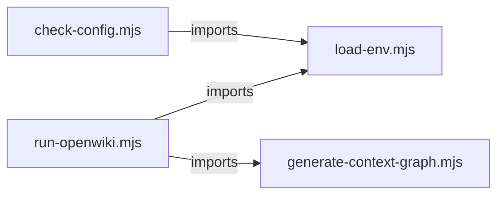

# `open_wiki/scripts/` — 4 module(s)

4 module(s).

## Dependencies

## `js:open_wiki/scripts/check-config.mjs`

- fan-in: 0, fan-out: 4

### Symbols
  _(no extracted symbols)_

## `js:open_wiki/scripts/generate-context-graph.mjs`

- fan-in: 1, fan-out: 5

### Symbols
  - `exists` (function) → js:open_wiki/scripts/generate-context-graph.mjs:10 — `async function exists(target)`
  - `markdownFiles` (function) → js:open_wiki/scripts/generate-context-graph.mjs:19 — `async function markdownFiles(directory)`
  - `parseDocument` (function) → js:open_wiki/scripts/generate-context-graph.mjs:29 — `function parseDocument(text)`
  - `resolveWikiLink` (function) → js:open_wiki/scripts/generate-context-graph.mjs:48 — `function resolveWikiLink(target, documentId)`
  - `resolveSourcePath` (function) → js:open_wiki/scripts/generate-context-graph.mjs:54 — `async function resolveSourcePath(candidate, repositoryRoot)`
  - `sourceReferences` (function) → js:open_wiki/scripts/generate-context-graph.mjs:65 — `async function sourceReferences({ body, frontmatter, repositoryRoot })`
  - `escapeHtml` (function) → js:open_wiki/scripts/generate-context-graph.mjs:77 — `function escapeHtml(value)`
  - `htmlDocument` (function) → js:open_wiki/scripts/generate-context-graph.mjs:83 — `function htmlDocument(graph)`
  - `generateContextGraph` (function) → js:open_wiki/scripts/generate-context-graph.mjs:122 — `async function generateContextGraph({ bundleRoot, repositoryRoot, outPath, name })`
  - `main` (function) → js:open_wiki/scripts/generate-context-graph.mjs:157 — `async function main()`

## `js:open_wiki/scripts/load-env.mjs`

- fan-in: 2, fan-out: 1

### Symbols
  - `loadEnvFile` (function) → js:open_wiki/scripts/load-env.mjs:7 — `async function loadEnvFile(filePath)`

## `js:open_wiki/scripts/run-openwiki.mjs`

- fan-in: 0, fan-out: 8

### Symbols
  - `exists` (function) → js:open_wiki/scripts/run-openwiki.mjs:16 — `async function exists(target)`
  - `configuredEnvironment` (function) → js:open_wiki/scripts/run-openwiki.mjs:25 — `function configuredEnvironment(environment)`
  - `restoreWiki` (function) → js:open_wiki/scripts/run-openwiki.mjs:35 — `async function restoreWiki()`
  - `prepareStagingDirectory` (function) → js:open_wiki/scripts/run-openwiki.mjs:44 — `async function prepareStagingDirectory()`
  - `normalizeOpenWikiPointers` (function) → js:open_wiki/scripts/run-openwiki.mjs:54 — `async function normalizeOpenWikiPointers()`
  - `syncWorkflow` (function) → js:open_wiki/scripts/run-openwiki.mjs:68 — `async function syncWorkflow()`
  - `main` (function) → js:open_wiki/scripts/run-openwiki.mjs:75 — `async function main()`
