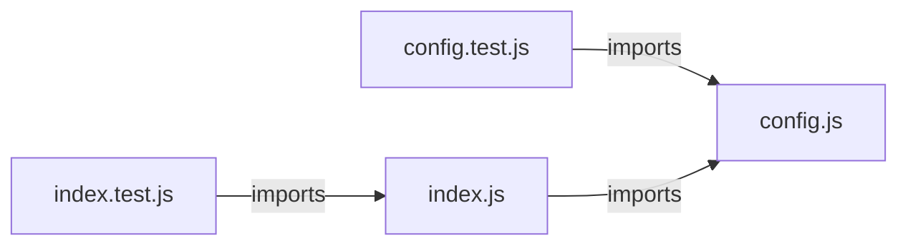

# `symphony_clone/src/` — 4 module(s)

4 module(s).

## Dependencies

## `js:symphony_clone/src/config.js`

- fan-in: 5, fan-out: 2

### Symbols
  - `intFromEnv` (function) → js:symphony_clone/src/config.js:10 — `function intFromEnv(name, fallback)`
  - `splitList` (function) → js:symphony_clone/src/config.js:20 — `function splitList(raw, fallback)`
  - `requiredEnv` (function) → js:symphony_clone/src/config.js:25 — `function requiredEnv(name)`
  - `loadEnvFile` (function) → js:symphony_clone/src/config.js:33 — `function loadEnvFile(env = process.env, envPath = path.resolve(process.cwd(), '.env'))`
  - `parseEnvFile` (function) → js:symphony_clone/src/config.js:45 — `function parseEnvFile(raw)`
  - `loadConfig` (function) → js:symphony_clone/src/config.js:71 — `function loadConfig(env = process.env, options = {})`
  - `normalizeProvider` (function) → js:symphony_clone/src/config.js:99 — `function normalizeProvider(raw)`
  - `maybeLoadDotEnv` (function) → js:symphony_clone/src/config.js:105 — `function maybeLoadDotEnv(env, options)`
  - `resolveRetention` (function) → js:symphony_clone/src/config.js:110 — `function resolveRetention(env)`
  - `buildRetry` (function) → js:symphony_clone/src/config.js:118 — `function buildRetry(env)`
  - `buildGithub` (function) → js:symphony_clone/src/config.js:126 — `function buildGithub(env)`
  - `normalizeMergeMethod` (function) → js:symphony_clone/src/config.js:135 — `function normalizeMergeMethod(raw)`
  - `buildAutoMerge` (function) → js:symphony_clone/src/config.js:143 — `function buildAutoMerge(env)`
  - `buildTracker` (function) → js:symphony_clone/src/config.js:152 — `function buildTracker(env)`
  - `buildLinear` (function) → js:symphony_clone/src/config.js:169 — `function buildLinear(env)`
  - `buildJira` (function) → js:symphony_clone/src/config.js:177 — `function buildJira(env)`
  - `buildAzure` (function) → js:symphony_clone/src/config.js:186 — `function buildAzure(env)`
  - `resolveMaxWallclockMs` (function) → js:symphony_clone/src/config.js:197 — `function resolveMaxWallclockMs(env)`
  - `intFromEnvWithEnv` (function) → js:symphony_clone/src/config.js:211 — `function intFromEnvWithEnv(env, name, fallback, options = {})`
  - `validateConfig` (function) → js:symphony_clone/src/config.js:228 — `function validateConfig(config)`

## `js:symphony_clone/src/config.test.js`

- fan-in: 0, fan-out: 3

### Symbols
  - `baseEnv` (function) → js:symphony_clone/src/config.test.js:9 — `baseEnv = () => ({ TARGET_REPO_URL: 'git@github.com:o/r.git', LINEAR_API_KEY: 'k', LINEAR_PROJECT_SLUG: 's' })`

## `js:symphony_clone/src/index.js`

- fan-in: 1, fan-out: 10

### Symbols
  - `main` (function) → js:symphony_clone/src/index.js:14 — `async function main()`
  - `createTracker` (function) → js:symphony_clone/src/index.js:32 — `function createTracker(config)`
  - `makeSerializedTick` (function) → js:symphony_clone/src/index.js:42 — `function makeSerializedTick(scheduler)`
  - `installSignalHandlers` (function) → js:symphony_clone/src/index.js:60 — `function installSignalHandlers(scheduler, logger)`
  - `runTick` (function) → js:symphony_clone/src/index.js:70 — `async function runTick(scheduler)`

## `js:symphony_clone/src/index.test.js`

- fan-in: 0, fan-out: 3

### Symbols
  _(no extracted symbols)_
