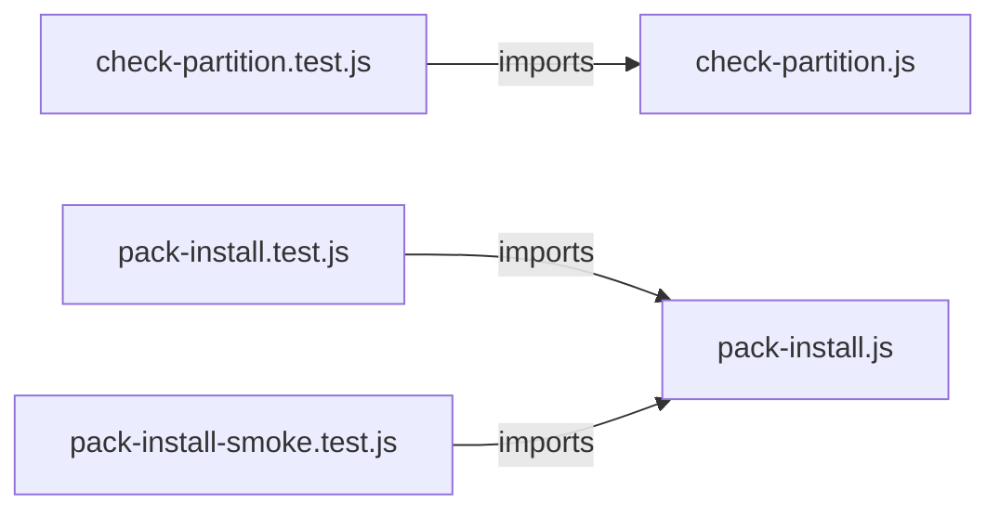

# `tools/` — 5 module(s)

5 module(s).

## Dependencies

## `js:tools/check-partition.js`

- fan-in: 1, fan-out: 2

### Symbols
  - `escapeRe` (function) → js:tools/check-partition.js:27 — `escapeRe = (s) => s.replace(/[.*+?^${}()|[\]\\]/g, '\\$&')`
  - `scriptPattern` (function) → js:tools/check-partition.js:46 — `function scriptPattern(name, fromKind)`
  - `libPattern` (function) → js:tools/check-partition.js:54 — `function libPattern(name, fromKind)`
  - `skillPattern` (function) → js:tools/check-partition.js:62 — `function skillPattern(name)`
  - `agentPattern` (function) → js:tools/check-partition.js:68 — `function agentPattern(name)`
  - `hardRefPattern` (function) → js:tools/check-partition.js:73 — `function hardRefPattern(kind, name, fromKind)`
  - `specName` (function) → js:tools/check-partition.js:103 — `specName = (spec) => String(spec).replace(/\.js$/, '').split('/').pop()`
  - `tryBlockSpans` (function) → js:tools/check-partition.js:106 — `function tryBlockSpans(text)`
  - `optionalRefs` (function) → js:tools/check-partition.js:122 — `function optionalRefs(text)`
  - `hardRefs` (function) → js:tools/check-partition.js:131 — `function hardRefs(text, names, optional = new Set(), fromKind = null)`
  - `guardedEdges` (function) → js:tools/check-partition.js:145 — `function guardedEdges(from, optionalNames, ids, assign)`
  - `partitionAccepted` (function) → js:tools/check-partition.js:160 — `function partitionAccepted(accepted)`
  - `checkPartition` (function) → js:tools/check-partition.js:172 — `function checkPartition({ assign, texts, names, accepted = [] })`
  - `walk` (function) → js:tools/check-partition.js:206 — `function walk(dir, acc = [])`
  - `readUnit` (function) → js:tools/check-partition.js:217 — `readUnit = (files) => files.map((f) =>`
  - `loadAssignment` (function) → js:tools/check-partition.js:221 — `function loadAssignment(partition)`
  - `loadUnitTexts` (function) → js:tools/check-partition.js:232 — `function loadUnitTexts()`
  - `reportCrossPack` (function) → js:tools/check-partition.js:249 — `function reportCrossPack(crossPack)`
  - `reportViolations` (function) → js:tools/check-partition.js:260 — `function reportViolations(violations)`
  - `main` (function) → js:tools/check-partition.js:275 — `function main()`

## `js:tools/check-partition.test.js`

- fan-in: 0, fan-out: 3

### Symbols
  _(no extracted symbols)_

## `js:tools/pack-install-smoke.test.js`

- fan-in: 0, fan-out: 7

### Symbols
  - `kernelOnly` (function) → js:tools/pack-install-smoke.test.js:26 — `function kernelOnly()`
  - `node` (function) → js:tools/pack-install-smoke.test.js:36 — `node = (args, opts = {}) => spawnSync('node', args, { encoding: 'utf8', timeout: 60000, ...opts })`

## `js:tools/pack-install.js`

- fan-in: 2, fan-out: 2

### Symbols
  - `loadPartition` (function) → js:tools/pack-install.js:60 — `function loadPartition(file = PARTITION)`
  - `mergeSpec` (function) → js:tools/pack-install.js:64 — `function mergeSpec(into, spec)`
  - `resolveSelection` (function) → js:tools/pack-install.js:75 — `function resolveSelection(partition, packs = [])`
  - `filesFor` (function) → js:tools/pack-install.js:89 — `function filesFor(selection)`
  - `copyRecursive` (function) → js:tools/pack-install.js:100 — `function copyRecursive(from, to)`
  - `materialize` (function) → js:tools/pack-install.js:111 — `function materialize(outDir, rels)`
  - `declaredNames` (function) → js:tools/pack-install.js:124 — `function declaredNames(partition)`
  - `undeclaredUnits` (function) → js:tools/pack-install.js:141 — `function undeclaredUnits(partition, root = ROOT)`
  - `argValue` (function) → js:tools/pack-install.js:156 — `function argValue(argv, flag)`
  - `listPacks` (function) → js:tools/pack-install.js:161 — `function listPacks(partition)`
  - `main` (function) → js:tools/pack-install.js:170 — `function main(argv = process.argv.slice(2))`

## `js:tools/pack-install.test.js`

- fan-in: 0, fan-out: 3

### Symbols
  _(no extracted symbols)_
