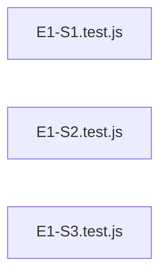

# `test/e2e/full-auto-output/specs/test_artefacts/acceptance/` — 3 module(s)

3 module(s).

## Dependencies

## `js:test/e2e/full-auto-output/specs/test_artefacts/acceptance/E1-S1.test.js`

- fan-in: 0, fan-out: 3

### Symbols
  _(no extracted symbols)_

## `js:test/e2e/full-auto-output/specs/test_artefacts/acceptance/E1-S2.test.js`

- fan-in: 0, fan-out: 3

### Symbols
  _(no extracted symbols)_

## `js:test/e2e/full-auto-output/specs/test_artefacts/acceptance/E1-S3.test.js`

- fan-in: 0, fan-out: 4

### Symbols
  _(no extracted symbols)_
