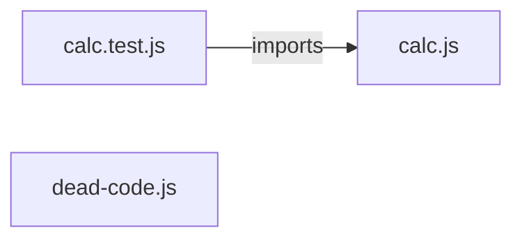

# `test/evals/fixtures/calc-app/` — 3 module(s)

3 module(s).

## Dependencies

## `js:test/evals/fixtures/calc-app/calc.js`

- fan-in: 1, fan-out: 0

### Symbols
  - `sum` (function) → js:test/evals/fixtures/calc-app/calc.js:3 — `function sum(numbers)`
  - `average` (function) → js:test/evals/fixtures/calc-app/calc.js:9 — `function average(numbers)`

## `js:test/evals/fixtures/calc-app/calc.test.js`

- fan-in: 0, fan-out: 3

### Symbols
  _(no extracted symbols)_

## `js:test/evals/fixtures/calc-app/dead-code.js`

- fan-in: 0, fan-out: 0

### Symbols
  - `oldSum` (function) → js:test/evals/fixtures/calc-app/dead-code.js:5 — `function oldSum(arr)`
