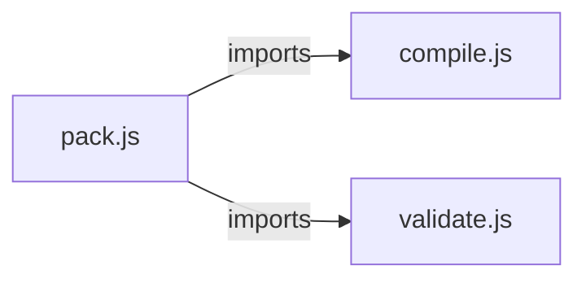

# `dsl-packs/private-equity/waterfall/` — 3 module(s)

3 module(s).

## Dependencies

## `js:dsl-packs/private-equity/waterfall/compile.js`

- fan-in: 1, fan-out: 0

### Symbols
  - `normalizeTier` (function) → js:dsl-packs/private-equity/waterfall/compile.js:1 — `function normalizeTier(t)`
  - `compile` (function) → js:dsl-packs/private-equity/waterfall/compile.js:16 — `function compile(surface)`

## `js:dsl-packs/private-equity/waterfall/pack.js`

- fan-in: 3, fan-out: 3

### Symbols
  _(no extracted symbols)_

## `js:dsl-packs/private-equity/waterfall/validate.js`

- fan-in: 1, fan-out: 0

### Symbols
  - `pct` (function) → js:dsl-packs/private-equity/waterfall/validate.js:3 — `function pct(x) { return '${round(x * 100)}%'; }`
  - `round` (function) → js:dsl-packs/private-equity/waterfall/validate.js:4 — `function round(x) { return Math.round(x * 100) / 100; }`
  - `checkCanonicalOrder` (function) → js:dsl-packs/private-equity/waterfall/validate.js:6 — `function checkCanonicalOrder(tiers)`
  - `checkRocPresent` (function) → js:dsl-packs/private-equity/waterfall/validate.js:20 — `function checkRocPresent(tiers)`
  - `checkCatchupTarget` (function) → js:dsl-packs/private-equity/waterfall/validate.js:28 — `function checkCatchupTarget(tiers)`
  - `checkHurdleCoherence` (function) → js:dsl-packs/private-equity/waterfall/validate.js:41 — `function checkHurdleCoherence(ir, tiers)`
  - `checkSplits` (function) → js:dsl-packs/private-equity/waterfall/validate.js:61 — `function checkSplits(tiers)`
  - `checkCarryGates` (function) → js:dsl-packs/private-equity/waterfall/validate.js:73 — `function checkCarryGates(tiers)`
  - `checkRates` (function) → js:dsl-packs/private-equity/waterfall/validate.js:86 — `function checkRates(tiers)`
  - `checkAmericanClawback` (function) → js:dsl-packs/private-equity/waterfall/validate.js:113 — `function checkAmericanClawback(ir)`
  - `validate` (function) → js:dsl-packs/private-equity/waterfall/validate.js:121 — `function validate(ir)`
