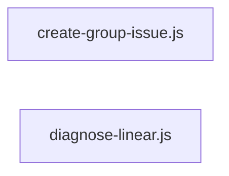

# `symphony_clone/scripts/` — 2 module(s)

2 module(s).

## Dependencies

## `js:symphony_clone/scripts/create-group-issue.js`

- fan-in: 0, fan-out: 1

### Symbols
  - `main` (function) → js:symphony_clone/scripts/create-group-issue.js:24 — `async function main()`
  - `renderDescription` (function) → js:symphony_clone/scripts/create-group-issue.js:68 — `function renderDescription({ group, stories, title, dependsOn, teamKey })`
  - `parseArgs` (function) → js:symphony_clone/scripts/create-group-issue.js:86 — `function parseArgs(argv)`
  - `indent` (function) → js:symphony_clone/scripts/create-group-issue.js:103 — `function indent(text, n)`
  - `LinearClient` (class) → js:symphony_clone/scripts/create-group-issue.js:108 — `class LinearClient`

## `js:symphony_clone/scripts/diagnose-linear.js`

- fan-in: 0, fan-out: 1

### Symbols
  - `main` (function) → js:symphony_clone/scripts/diagnose-linear.js:5 — `async function main()`
