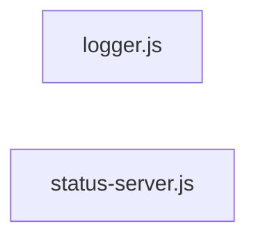

# `symphony_clone/src/observability/` — 2 module(s)

2 module(s).

## Dependencies

## `js:symphony_clone/src/observability/logger.js`

- fan-in: 1, fan-out: 2

### Symbols
  - `JsonlLogger` (class) → js:symphony_clone/src/observability/logger.js:6 — `class JsonlLogger`
  - `createLogger` (function) → js:symphony_clone/src/observability/logger.js:33 — `function createLogger(config)`

## `js:symphony_clone/src/observability/status-server.js`

- fan-in: 2, fan-out: 1

### Symbols
  - `startStatusServer` (function) → js:symphony_clone/src/observability/status-server.js:5 — `function startStatusServer({ port, stateStore, logger })`
  - `createStatusHandler` (function) → js:symphony_clone/src/observability/status-server.js:16 — `function createStatusHandler({ stateStore })`
  - `sendJson` (function) → js:symphony_clone/src/observability/status-server.js:33 — `function sendJson(response, status, body)`
  - `renderDashboard` (function) → js:symphony_clone/src/observability/status-server.js:38 — `function renderDashboard(snapshot)`
  - `escapeHtml` (function) → js:symphony_clone/src/observability/status-server.js:48 — `function escapeHtml(value)`
