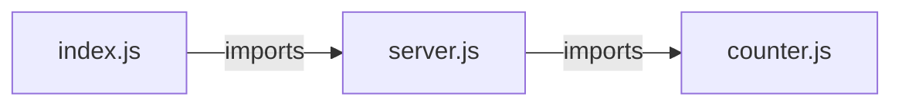

# `test/e2e/full-auto-output/src/` — 3 module(s)

3 module(s).

## Dependencies

## `js:test/e2e/full-auto-output/src/counter.js`

- fan-in: 2, fan-out: 0

### Symbols
  - `getCount` (function) → js:test/e2e/full-auto-output/src/counter.js:10 — `function getCount()`
  - `increment` (function) → js:test/e2e/full-auto-output/src/counter.js:18 — `function increment()`

## `js:test/e2e/full-auto-output/src/index.js`

- fan-in: 1, fan-out: 2

### Symbols
  - `resolvePort` (function) → js:test/e2e/full-auto-output/src/index.js:15 — `function resolvePort(env)`
  - `startServer` (function) → js:test/e2e/full-auto-output/src/index.js:24 — `function startServer(port)`

## `js:test/e2e/full-auto-output/src/server.js`

- fan-in: 4, fan-out: 1

### Symbols
  - `createRequestHandler` (function) → js:test/e2e/full-auto-output/src/server.js:13 — `function createRequestHandler()`
  - `sendJson` (function) → js:test/e2e/full-auto-output/src/server.js:34 — `function sendJson(res, statusCode, body)`
