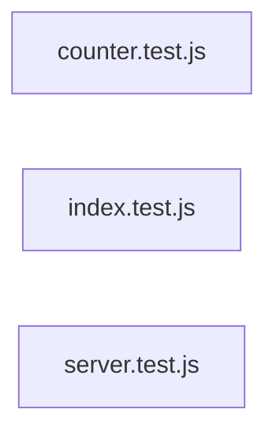

# `test/e2e/full-auto-output/tests/` — 3 module(s)

3 module(s).

## Dependencies

## `js:test/e2e/full-auto-output/tests/counter.test.js`

- fan-in: 0, fan-out: 3

### Symbols
  _(no extracted symbols)_

## `js:test/e2e/full-auto-output/tests/index.test.js`

- fan-in: 0, fan-out: 4

### Symbols
  _(no extracted symbols)_

## `js:test/e2e/full-auto-output/tests/server.test.js`

- fan-in: 0, fan-out: 5

### Symbols
  - `startTestServer` (function) → js:test/e2e/full-auto-output/tests/server.test.js:13 — `async function startTestServer()`
