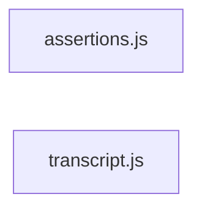

# `test/evals/helpers/` — 2 module(s)

2 module(s).

## Dependencies

## `js:test/evals/helpers/assertions.js`

- fan-in: 2, fan-out: 3

### Symbols
  - `listFiles` (function) → js:test/evals/helpers/assertions.js:14 — `function listFiles(dir, prefix = '')`
  - `fileDiffers` (function) → js:test/evals/helpers/assertions.js:26 — `function fileDiffers(fixtureDir, workDir, rel)`
  - `checkTranscript` (function) → js:test/evals/helpers/assertions.js:33 — `function checkTranscript(a, ctx)`
  - `checkFilesUnchanged` (function) → js:test/evals/helpers/assertions.js:41 — `function checkFilesUnchanged(a, ctx)`
  - `checkWorkdirUnchanged` (function) → js:test/evals/helpers/assertions.js:46 — `function checkWorkdirUnchanged(ctx)`
  - `checkFileMatches` (function) → js:test/evals/helpers/assertions.js:61 — `function checkFileMatches(a, ctx)`
  - `checkFixtureTests` (function) → js:test/evals/helpers/assertions.js:70 — `function checkFixtureTests(a, ctx)`
  - `checkOne` (function) → js:test/evals/helpers/assertions.js:90 — `function checkOne(a, ctx)`
  - `applyAssertions` (function) → js:test/evals/helpers/assertions.js:107 — `function applyAssertions(assertions, ctx)`

## `js:test/evals/helpers/transcript.js`

- fan-in: 1, fan-out: 0

### Symbols
  - `extractTranscript` (function) → js:test/evals/helpers/transcript.js:8 — `function extractTranscript(streamJsonStdout)`
