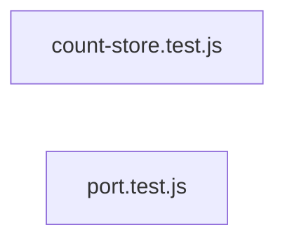

# `test/e2e/full-auto-output/tests/` — 2 module(s)

2 module(s).

## Dependencies

## `js:test/e2e/full-auto-output/tests/count-store.test.js`

- fan-in: 0, fan-out: 4

### Symbols
  _(no extracted symbols)_

## `js:test/e2e/full-auto-output/tests/port.test.js`

- fan-in: 0, fan-out: 3

### Symbols
  _(no extracted symbols)_
