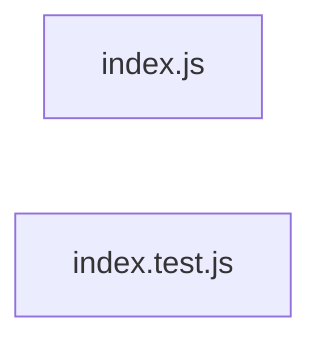

# `test/e2e/auto-output/` — 2 module(s)

2 module(s).

## Dependencies

## `js:test/e2e/auto-output/index.js`

- fan-in: 0, fan-out: 0

### Symbols
  - `parseIntArg` (function) → js:test/e2e/auto-output/index.js:16 — `function parseIntArg(raw)`
  - `main` (function) → js:test/e2e/auto-output/index.js:29 — `function main(argv)`

## `js:test/e2e/auto-output/index.test.js`

- fan-in: 0, fan-out: 4

### Symbols
  - `runCli` (function) → js:test/e2e/auto-output/index.test.js:11 — `function runCli(args)`
