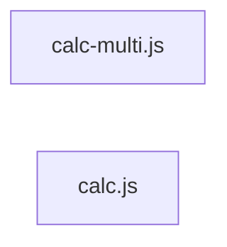

# `test/fixtures/mutation/` — 2 module(s)

2 module(s).

## Dependencies

## `js:test/fixtures/mutation/calc-multi.js`

- fan-in: 0, fan-out: 0

### Symbols
  - `f` (function) → js:test/fixtures/mutation/calc-multi.js:1 — `f = (a, b) => a >= b && a < 9 && a == 1`

## `js:test/fixtures/mutation/calc.js`

- fan-in: 0, fan-out: 0

### Symbols
  - `isAdult` (function) → js:test/fixtures/mutation/calc.js:1 — `isAdult = (age) => age >= 18`
