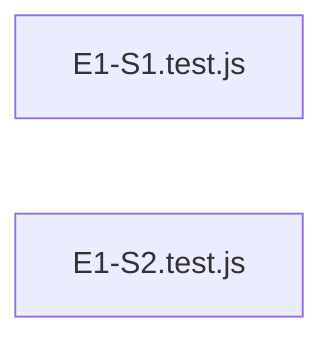

# `test/e2e/full-auto-output/specs/test_artefacts/acceptance/` — 2 module(s)

2 module(s).

## Dependencies

## `js:test/e2e/full-auto-output/specs/test_artefacts/acceptance/E1-S1.test.js`

- fan-in: 0, fan-out: 4

### Symbols
  - `withServer` (function) → js:test/e2e/full-auto-output/specs/test_artefacts/acceptance/E1-S1.test.js:17 — `function withServer(run)`
  - `request` (function) → js:test/e2e/full-auto-output/specs/test_artefacts/acceptance/E1-S1.test.js:34 — `function request(port, method, path)`

## `js:test/e2e/full-auto-output/specs/test_artefacts/acceptance/E1-S2.test.js`

- fan-in: 0, fan-out: 4

### Symbols
  - `withServer` (function) → js:test/e2e/full-auto-output/specs/test_artefacts/acceptance/E1-S2.test.js:13 — `function withServer(run)`
  - `request` (function) → js:test/e2e/full-auto-output/specs/test_artefacts/acceptance/E1-S2.test.js:30 — `function request(port, method, path)`
