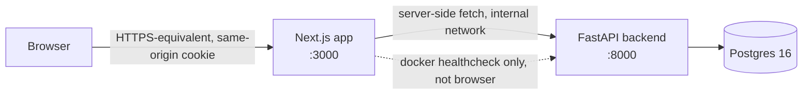

# Architecture — shortlink (sprint 1)

Python 3.12 / FastAPI backend, Next.js / TypeScript frontend, Postgres 16.
Strict layered architecture (Types → Config → Repository → Service → API →
UI), one-way dependencies only, per `.claude/architecture.md`.

## Recorded decisions

Every row below is load-bearing (`specs/decisions/design-decisions.json`).
`Rules out` is a prohibition — a document or diff that reintroduces it is
wrong even if otherwise sound.

| ID | Decision | Rules out |
|----|----------|-----------|
| D-1 | Next.js Route Handlers proxy **every** call to FastAPI server-side (register, sign-in, sign-out, links CRUD, and the public `/{code}` redirect). The browser only ever talks to the Next.js origin. The session cookie is `HttpOnly`, `Secure`, `SameSite=Lax`, scoped to the Next.js origin. | Direct cross-origin browser→FastAPI calls; CORS-with-credentials; `SameSite=None`; any requirement for HTTPS in local/dev compose (`Secure` cookies are accepted by browsers on `http://localhost` as a secure context, so this holds without TLS). |
| D-2 | Sessions are DB-backed: a `sessions` table (`id`, `member_id`, `created_at`, `expires_at`, `revoked_at`). Sign-out sets `revoked_at`; a Session is valid only while `revoked_at IS NULL` (and, if ever populated, `expires_at` in the future). | Stateless JWTs; any client-held bearer token not tied to a server-side revocable row. |
| D-3 | Link delete is a soft delete (`deleted_at` on `links`), with a `UNIQUE` constraint on `code` across **all** rows, deleted or not. | Hard-deleting link rows; a separate reserved-codes table. |
| D-4 | CSRF mitigation is `SameSite=Lax` cookies plus same-origin-only Route Handlers — no separate token. | A double-submit CSRF token mechanism. |

## Components



- **Next.js (frontend)** — the only origin the browser talks to (D-1).
  - `app/console/page.tsx` — the Console (server component, reads the list
    on load; client components handle pagination + delete).
  - `app/api/**/route.ts` — Route Handlers that proxy 1:1 to FastAPI,
    forwarding/receiving the session cookie and relaying status codes.
  - `app/[code]/route.ts` — proxies the public redirect: calls FastAPI's
    `GET /{code}` and relays its `Location`/status without itself following
    the target (same non-fetching contract as the backend handler it wraps).
- **FastAPI (backend)** — never called directly by the browser. Layered per
  `backend/CLAUDE.md`: `api/` (routes) → `services/` (business rules) →
  `repository/` (Postgres access), with `types/` and `config/` underneath
  both. `services/` never imports from `api/`; `repository/` never imports
  from `services/`.
- **Postgres 16** — the only datastore; one compose service (E7-S1).

No pass-through modules: the Next.js Route Handlers are the one legitimate
proxy layer (an explicit consequence of D-1's cookie-scoping requirement),
not a speculative abstraction — deleting them would put the FastAPI cookie
back in front of the browser cross-origin, which D-1 rules out.

## Sequence — register, sign in, create, redirect

```mermaid
sequenceDiagram
    participant B as Browser
    participant N as Next.js Route Handler
    participant F as FastAPI
    participant P as Postgres

    B->>N: POST /api/auth/register {email, password}
    N->>F: POST /auth/register
    F->>F: Argon2id hash password
    F->>P: INSERT members
    F-->>N: 201 {id, email}
    N-->>B: 201 (no cookie yet)

    B->>N: POST /api/auth/sign-in {email, password}
    N->>F: POST /auth/sign-in
    F->>P: SELECT member by email
    F->>F: verify Argon2id hash
    F->>P: INSERT sessions
    F-->>N: 200 {id, email} + Set-Cookie(session_id)
    N-->>B: 200 + Set-Cookie(session_id; HttpOnly; Secure; SameSite=Lax)

    B->>N: POST /api/links {targetUrl} (cookie attached)
    N->>F: POST /links (cookie forwarded)
    F->>F: validate session (not revoked/expired)
    F->>F: validate target: scheme allow-list, host deny-list (literal only)
    F->>F: generate code (CSPRNG, >=7 chars)
    F->>P: INSERT links
    F-->>N: 201 {code, targetUrl, createdAt}
    N-->>B: 201

    B->>N: GET /{code} (plain navigation)
    N->>F: GET /{code}
    F->>P: SELECT link WHERE code=? AND deleted_at IS NULL
    F-->>N: 302 Location: targetUrl
    N-->>B: 302 Location: targetUrl (relayed, not followed)
```

## Data flows

- **Auth writes** (register, sign-in, sign-out) flow Browser → Next Route
  Handler → FastAPI `api/auth.py` → `services/auth_service.py` →
  `repository/member_repository.py` / `repository/session_repository.py` →
  Postgres. Passwords never leave `services/auth_service.py` unhashed; the
  Argon2id hash is the only form written to `repository/` or to any log.
- **Link writes** (create, delete) flow Browser → Next Route Handler →
  FastAPI `api/links.py` → `services/link_service.py` (target validation +
  code generation) → `repository/link_repository.py` → Postgres.
- **Link reads** (list, redirect) flow the same path minus validation;
  `GET /{code}` is unauthenticated and reads through `link_repository.py`
  only, never touching `member_repository.py`.
- **Health** (`GET /healthz`) is served by FastAPI directly (not proxied
  through Next — it is read by the docker-compose healthcheck, not the
  browser) and performs one lightweight Postgres reachability check via
  `repository/db.py`.
- **DB-unreachable path**: any endpoint other than `/healthz`, on a
  Postgres connection failure, is caught by a global FastAPI exception
  handler (`api/error_handlers.py`) that returns 503 with a fixed JSON
  envelope — never the raised exception's message, class name, or traceback.

## Latency budget

Story E4-S2 requires p95 < 300 ms for `POST /links` and `GET /links` at 100
seeded links on one account — the specific ratchet this sprint's load-test
harness asserts. The project's general runtime SLO
(`project-manifest.json` / `CLAUDE.md`: `p95_ms: 500`, `error_rate_pct: 1`)
is the looser, stack-wide budget every other endpoint is held to. `GET /links`
is paginated (`LIMIT 20`) and indexed on `(owner_id, created_at DESC)` —
no unbounded scan, no N+1 (the list query is one indexed round trip).
