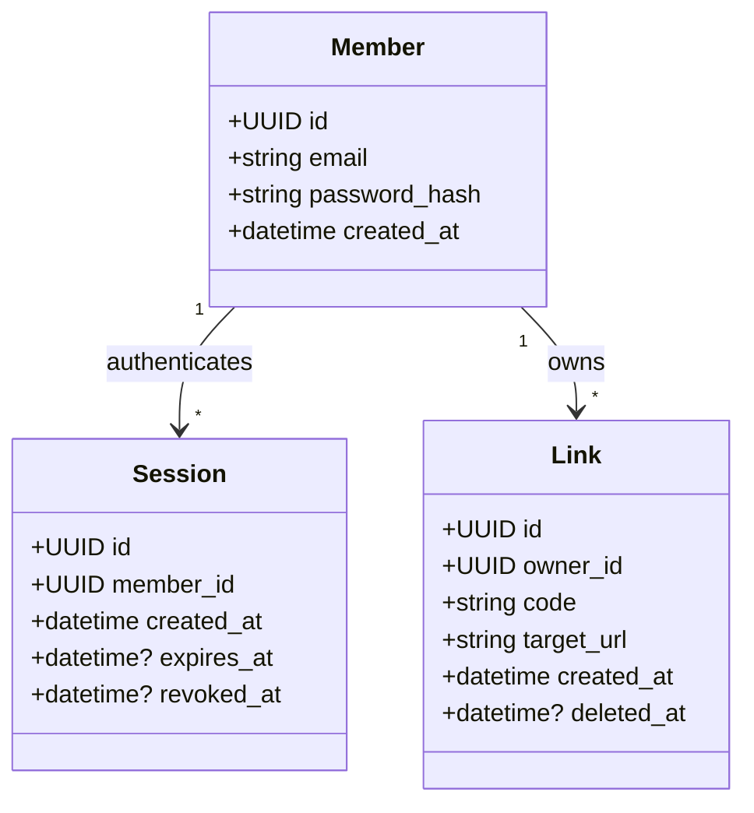

# REASONS Canvas — shortlink (sprint 1)

## Requirements

A signed-in Member registers, mints a short Link from a Target URL, is
redirected by its Code, sees only their own Links on a Console, deletes one,
and signs out with the server-side session actually invalidated. The service
runs from one `docker compose up`, stays fast at 100 Links/account, is
WCAG 2.2 AA on the Console, refuses SSRF-shaped targets, and degrades to a
clean 503 rather than a stack trace when Postgres is down.

Definition of done: all 7 epics / 11 stories in `specs/stories/stories.json`
pass their acceptance criteria — E1-S1 (register/sign-in), E1-S2 (sign-out),
E2-S1 (create), E3-S1 (redirect), E4-S1 (list/console), E4-S2 (latency),
E4-S3 (a11y), E5-S1 (delete), E6-S1 (`/healthz`), E6-S2 (503 envelope),
E7-S1 (compose).

## Entities

Greenfield project — `specs/brownfield/code-graph.json` does not exist, so
every entity below is **new**.

Business rules: a Session is valid only while `revoked_at IS NULL`; a Link's
`code` is `UNIQUE` across every row ever created, deleted or not (D-3), so a
deleted code is never reissued. See `CONTEXT.md` for full term definitions —
entity names here match it exactly.

## Approach

**Chosen**: FastAPI backend behind a Next.js proxy layer (D-1), DB-backed
sessions (D-2), soft-delete Links with a cross-row unique code constraint
(D-3), `SameSite=Lax` CSRF mitigation with no separate token (D-4).

**Alternatives rejected**:
- *Direct cross-origin browser→FastAPI calls* — would need CORS-with-
  credentials and `SameSite=None`, forcing HTTPS even in local compose;
  D-1 rejects this to keep NFR-5's single-command, no-external-dependency
  posture and avoid CORS entirely.
- *Stateless JWT sessions* — cannot satisfy FR-7's server-side sign-out
  invalidation without a denylist table, which is strictly more machinery
  than the sessions table D-2 already needs.
- *Hard-deleting Links* — would need a second reserved-codes structure to
  guarantee FR-5's "never reissued" property; the soft-delete's cross-row
  unique constraint gets the same guarantee from the database for free.
- *Double-submit CSRF token* — unnecessary once D-1 makes every
  state-changing request same-origin by construction.
- *DNS-resolving or fetch-following target validation* — rejected outright;
  FR-6/SG-10 require literal-only inspection so the validator itself can
  never be turned into an SSRF vector.

## Structure

Strict layered architecture (`.claude/architecture.md`): Types → Config →
Repository → Service → API → UI, one-way dependencies, matching
`architecture.md`. Backend: `api/` routes call `services/` (business rules,
including target validation and code generation) which call `repository/`
(Postgres access) — `services/` never imports `api/`; `repository/` never
imports `services/` (`backend/CLAUDE.md`). Frontend: `components/` never call
`fetch` directly — only `api/linksClient.ts` does, and only against the
same-origin Next.js Route Handlers, never the FastAPI origin directly
(`frontend/CLAUDE.md`, D-1).

## Operations

1. `backend/src/services/auth_service.register(email, password)` — Argon2id-hash,
   insert via `member_repository.py`. File: `backend/src/services/auth_service.py`.
2. `auth_service.sign_in(email, password)` — verify hash, insert `Session`
   via `session_repository.py`, return it for the router to set the cookie.
   File: `backend/src/services/auth_service.py`.
3. `auth_service.sign_out(session_id)` — set `revoked_at`. File: same.
4. `link_service.create_link(owner_id, target_url)` — `target_validation.validate_target`
   then `code_generator.generate_code`, retry on unique-constraint collision,
   insert via `link_repository.py`. File: `backend/src/services/link_service.py`.
5. `link_service.list_links(owner_id, page)` — `LIMIT 20` on the
   `(owner_id, created_at DESC)` index. File: same.
6. `link_service.delete_link(owner_id, code)` — set `deleted_at` where
   `owner_id` matches, else 404. File: same.
7. `api/redirect.py` — `link_repository.get_by_code` filtered on
   `deleted_at IS NULL`, return `Location` without fetching it.
8. `api/health.py` + `repository/db.check_db_reachable()` — single lightweight
   `SELECT 1`.
9. `api/error_handlers.py` — global exception handler catching DB
   connectivity failures, returning the fixed `ErrorBody` envelope.
10. `frontend/src/app/api/**/route.ts` — one Route Handler per backend
    endpoint, forwarding the `session_id` cookie and relaying status/body
    verbatim (D-1's proxy contract).

## Norms

- Naming: domain terms match `CONTEXT.md` exactly (`Member`, `Session`,
  `Link`, `code`, `targetUrl`) across Pydantic models, the OpenAPI schema, and
  TypeScript types.
- Every backend function is fully type-annotated (`backend/CLAUDE.md`); no
  `any` in TypeScript (`frontend/CLAUDE.md`).
- Errors are explicit exceptions in `services/` (`EmailAlreadyRegistered`,
  `InvalidCredentials`, `UnsafeTarget`, `LinkNotFound`, `NoActiveSession`)
  mapped to HTTP status in `api/`, never a silently-swallowed failure.
- Logging: password and password-hash bytes are excluded from every log
  line by a redaction filter (`backend/src/logging_config.py`), covering
  **SG-11**'s narrower point that structured request logging is not a
  required deliverable — but excluding secrets from whatever logging does
  exist is not optional (**NFR-3**).
- **SG-1** — code generation is always server-random (`code_generator.py`);
  no request field or code path accepts a caller-chosen code.
- **SG-2** — no update/PATCH endpoint on `Link`; changing a target is
  delete-then-recreate only.

## Safeguards

- **SG-1** — `POST /links` never accepts a client-supplied code; `LinkView`
  has no writable `code` field. Enforced by `CreateLinkRequest` (targetUrl
  only) in `api-contracts.schema.json`.
- **SG-2** — no `PATCH`/`PUT /links/{code}` exists in `api-contracts.md`;
  editing is out of scope for this sprint's routes entirely.
- **SG-3** — `Link` has no expiry field beyond `deleted_at` (permanent
  revocation, not a time window); no story or schema field introduces one.
- **SG-4** — no click-count column, analytics table, or tracking endpoint in
  `data-models.schema.json`.
- **SG-5** — every `Link`/`Session` query filters by `owner_id`/`member_id`;
  no team, workspace, or admin-role table exists.
- **SG-6** — no billing, plan, or quota field anywhere in the data models.
- **SG-7** — `auth_service` has no password-reset, SSO, or MFA path; only
  `register`/`sign_in`/`sign_out`.
- **SG-8** — no rate-limiting middleware or dependency in `main.py`.
- **SG-9** — no bulk-import or export endpoint in `api-contracts.md`.
- **SG-10** — `target_validation.validate_target` performs literal
  scheme/host/IP-range checks only; no `socket.getaddrinfo`/DNS call and no
  outbound HTTP client call anywhere in that module (FR-6's own text).
- **SG-11** — `deployment.md`'s CI/CD section explicitly does not ship
  OpenAPI publication, a scheduled purge job, or structured request logging
  as required deliverables this sprint.
- **Latency budget (NFR-1 / E4-S2)** — `POST /links` and `GET /links` p95
  < 300ms at 100 seeded links, asserted by `backend/tests/perf/test_latency.py`;
  `GET /links` is index-backed and paginated, no unbounded scan.
- **Security invariant (D-2/FR-7)** — a revoked or (if ever set) expired
  `Session` authenticates nothing; `require_session` checks both fields on
  every request.

## Governs

- `backend/src/types/models.py`
- `backend/src/config/settings.py`
- `backend/src/repository/db.py`
- `backend/src/repository/member_repository.py`
- `backend/src/repository/session_repository.py`
- `backend/src/repository/link_repository.py`
- `backend/src/services/auth_service.py`
- `backend/src/services/target_validation.py`
- `backend/src/services/code_generator.py`
- `backend/src/services/link_service.py`
- `backend/src/api/deps.py`
- `backend/src/api/auth.py`
- `backend/src/api/links.py`
- `backend/src/api/redirect.py`
- `backend/src/api/health.py`
- `backend/src/api/error_handlers.py`
- `backend/src/logging_config.py`
- `backend/src/main.py`
- `backend/tests/perf/test_latency.py`
- `frontend/src/app/console/page.tsx`
- `frontend/src/app/api/auth/register/route.ts`
- `frontend/src/app/api/auth/sign-in/route.ts`
- `frontend/src/app/api/auth/sign-out/route.ts`
- `frontend/src/app/api/links/route.ts`
- `frontend/src/app/api/links/[code]/route.ts`
- `frontend/src/app/[code]/route.ts`
- `frontend/src/components/LinkList.tsx`
- `frontend/src/components/LinkRow.tsx`
- `frontend/src/components/Pagination.tsx`
- `frontend/src/components/EmptyState.tsx`
- `frontend/src/api/linksClient.ts`
- `frontend/src/types/link.ts`
- `frontend/src/types/member.ts`
- `frontend/tests/console/a11y.spec.ts`
- `docker-compose.yml`
- `backend/Dockerfile`
- `frontend/Dockerfile`
- `.env.example`
